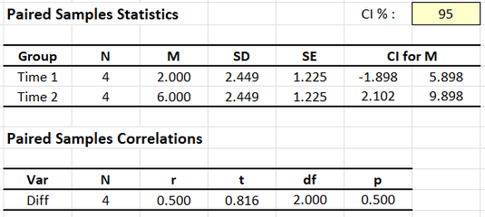
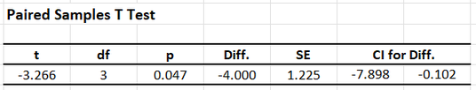

# [CREATE Articles](../index.md)

## Annotated Output | Paired Samples t Test

### Computer Output

The table of descriptive statistics can be used to determine the inferential statistics.

{: .output}

The table of inferential statistics shows the key elements to be calculated.

{: .output}

### Calculations

Descriptive Statistics: The descriptive statistics are calculated separately for each instance (which are shown as separate variables).

Mean Difference (Raw Effect): The Mean Difference is the difference between the sample mean and a user-specified test value or population mean.

> $$ M_{DIFF} = M - \mu = 4.000 − 0.000 = −4.000 $$

Statistical Significance: The *t* statistic is the ratio of the mean difference (raw effect) to the standard error of the mean.

> $$ t = \frac{M_{DIFF}}{SE_M} = \frac{-4.000}{1.225} = -3.266 $$
>
> With *df* = 3, *tCRITICAL* = 3.182  
> Because *t* > *tCRITICAL*, *p* < .05  
> This would be considered a statistically significant finding.

Confidence Interval: For this test, the appropriate confidence interval is around (centered on) the mean difference (raw effect).

> $$ CI_{DIFF} = M_{DIFF} \pm (t_{CRITICAL} ) (SE_M) = -4.000 \pm (3.182) (1.225) = [ −7.898, −0.102 ] $$
>
> Thus, the researcher concludes that the true population mean difference is somewhere between -7.898 and -0.102 (knowing that the estimate could be wrong).

Effect Size: Cohen’s *d* Statistic provides a standardized effect size for the mean difference (raw effect).

> $$ d = \frac{M_{DIFF}}{SD} = \frac{-4.000}{2.449} = -1.633 $$
>
> Given Cohen's heuristics for interpreting effect sizes, this would be considered an extremely large effect.

### APA Style

For this analysis, the differences between two measurements on one set of people are being compared. Thus, the summary and the inferential statistics focus on that difference. The first example focuses on statistical significance testing, whereas the second version includes and emphasizes interpretation of the confidence interval and effect size. 

> A paired samples *t* test showed that the difference in Outcome scores (*N* = 4) between the first time point (*M* = 2.00, *SD* = 2.45) and second time point (*M* = 6.00, *SD* = 2.45) was statistically significant, *t*(3) = -3.27, *p* = .047.

> Analyses revealed that Outcome scores (*N* = 4) increased dramatically from the first time point (*M* = 2.00, *SD* = 2.45) to the second time point (*M* = 6.00, *SD* = 2.45), 95% CI [-7.90, -0.10], *d* = -1.63, *t*(3) = -3.27, *p* = .047.

Alternatively, the means, standard deviations, and confidence intervals could be presented in a table or figure associated with this text.
