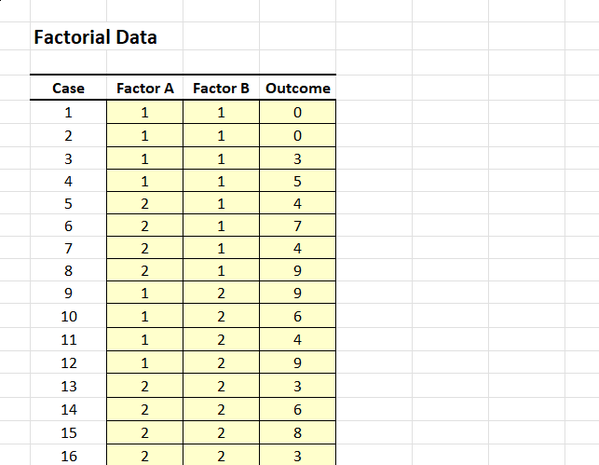
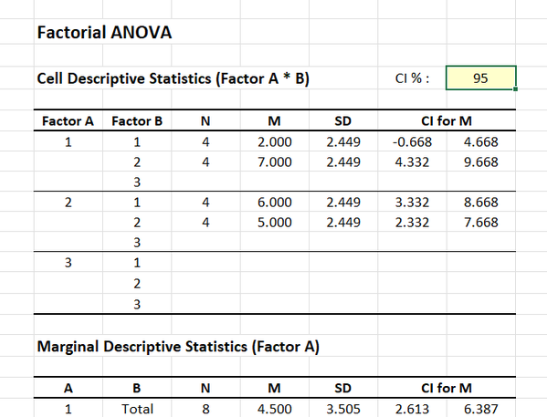

# [CREATE Articles](../index.md)

## Data Analysis | Factorial ANOVA

### Entering the Data 

1. From the available tabs, select "Factorial".

2. On the left side, you will be able to enter the data in the shaded cells.

3. Enter the data for all the participants. Notice that each participant has a score on the Factor A, Factor B, and Outcome Variables. There will be as many rows as people. 

4. On the categorical Factors, you will use numbers to represent the multiple categories (or “levels”) of the factors.

{: .image}

### Obtaining Descriptive and Inferential Statistics

5. Output will automatically appear on the right side of the tab. 

6. If you wish to alter the confidence intervals for the means, enter the preferred confidence level in the shaded cell after "CI %". 

{: .image}

