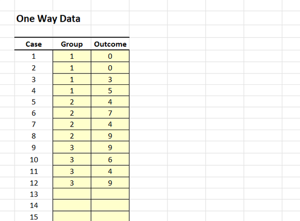
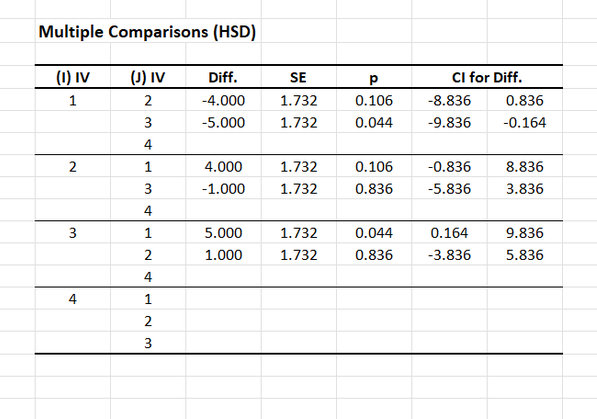

# [CREATE Articles](../index.md)

## Data Analysis | Post Hoc Comparisons

### Entering the Data 

1. From the available tabs, select "OneWay".

2. On the left side, you will be able to enter the data in the shaded cells.

3. Enter the data for all the participants. Notice that each participant has scores on both the Group and Outcome Variables. There will be as many rows as people. 

4. On the categorical Group variable, you will use numbers to represent the multiple categories (or “levels”) of the variable.

{: .screenshot}

### Obtaining Descriptive and Inferential Statistics

5. Output will automatically appear on the right side of the tab. 

6. If you wish to alter the confidence intervals for the means and post hoc comparisons, enter the preferred confidence level in the shaded cell after "CI %".

{: .screenshot}

