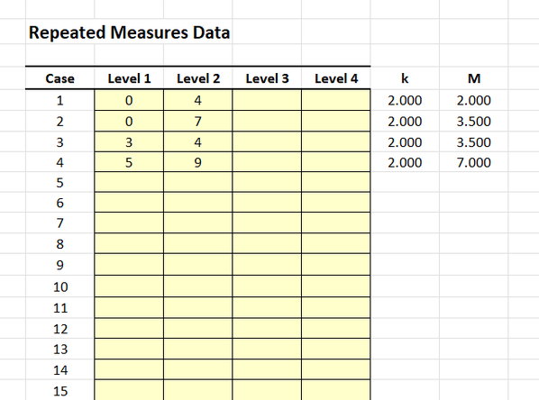
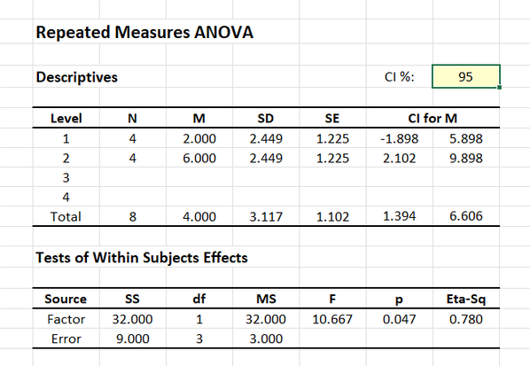

# [CREATE Articles](../index.md)

## Data Analysis | Repeated Measures ANOVA

### Entering the Data 

1. From the available tabs, select "Repeated".

2. On the left side, you will be able to enter the data in the shaded cells.

3. Enter the data in the individual cells of the column for the variable. Note that each cell should contain a single score for an individual person. There will be as many rows as people.

4. Notice that each individual (i.e., the rows) has a value for each instance of the within-subjects variable (i.e., the columns).

{: .image}

### Obtaining Descriptive and Inferential Statistics

5. Output will automatically appear on the right side of the tab. 

6. If you wish to alter the confidence intervals for the means, enter the preferred confidence level in the shaded cell after "CI %". 

{: .image}

