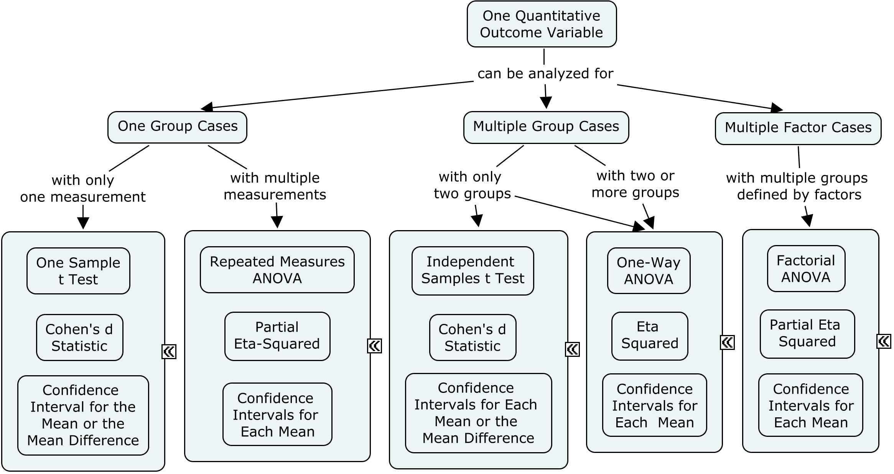

# [Intro Articles](../index.md)

## Statistical Analyses | Choosing Appropriate Inferential Statistics

### Basic Research Design and Statistics Terminology

- Factor: The variable that identifies the different groups or conditions in a study. This is referred to as the independent variable in an experiment.
- Outcome Variable: The measured outcome of study. This is referred to as the dependent variable in an experiment. 
- Between-Subjects Design: Research design where different groups of people are being compared. Also referred to as an independent samples design.
- Within-Subjects Design: Research design where only one group of people is studied, but under multiple conditions or measures. Also called a dependent samples design.
- Significance Test: Utilizes probability to determine the likelihood of the results given assumptions about the population. ANOVA and *t* are examples.
- Confidence Interval: Provides a range of values to estimate a statistic (e.g., means, mean differences, etc.) using a procedure that produces an accurate estimate a specified percentage of times.
- Standardized Effect Size: Standardizes the raw mean difference relative to the standard deviation within groups. Cohen&#39;s *d* is one example.
- Variance Accounted For Effect Size: Standardizes the between group variability relative to the total variability. Eta2 is one example.

### A Decision Tree for Basic Statistics

Which type of effect size measure and statistical significance test (and to some extent, which type of confidence interval) should be calculated depends on the research design.

<kbd></kbd>

