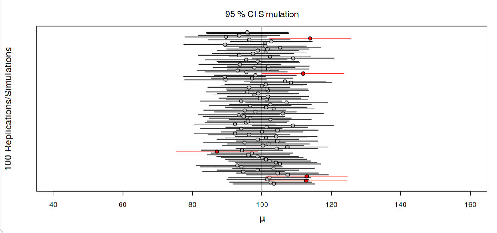

# Intro | Statistical Analyses

## Understanding Confidence Intervals

### Purpose of a Confidence Interval

The purpose of a confidence interval is to provide a range of values around a sample statistic that is likely to contain the true population parameter with a certain level of confidence. It is a statistical tool commonly used in inferential statistics to make inferences about a population based on a sample.

When we conduct surveys, experiments, or collect data from a sample of a population, it's often not feasible or practical to measure the entire population. Instead, we use statistical methods to estimate population parameters (e.g., population mean, population proportion) based on the information obtained from the sample.

A confidence interval gives us an estimate of the possible range within which the true population parameter is likely to lie. It is expressed as a lower and upper limit, with an associated confidence level.

### Calculating Confidence Intervals

Here's how it works:

1. Collect a sample: Take a random sample from the population of interest.
2. Calculate the sample statistic: Compute the sample statistic of interest (e.g., sample mean, sample proportion).
3. Determine the confidence level: Choose a confidence level, often denoted by (1 - α), where α is the significance level (usually set at 0.05 or 0.01). Commonly used confidence levels are 95% or 99%, but any confidence level between 0% and 100% can be chosen.
4. Calculate the margin of error: The margin of error represents the maximum distance the sample statistic is expected to deviate from the true population parameter. It is determined by the standard error, which is influenced by the sample size and the variability of the data.
5. Construct the confidence interval: Using the sample statistic and the margin of error, create a range around the sample statistic. The confidence interval is calculated as: Confidence Interval = Sample Statistic ± Margin of Error
6. Interpretation: The confidence interval suggests that we are "confident" that the true population parameter lies within this range with the chosen confidence level. For example, if we calculate a 95% confidence interval for the population mean, we are 95% confident that the true population mean lies within that interval.

It's important to note that a 95% confidence interval does not mean there is a 95% probability that the true parameter lies within the interval; rather, it indicates that if we were to repeat the sampling process and construct intervals in the same way for many samples, approximately 95% of those intervals would contain the true population parameter.

### Visualizing Confidence Intervals

Let's assume that you conduct a large number of independent random samples from the same population (let's say 100 samples). For each sample, you construct a 95% confidence interval. Picture a series of horizontal lines representing the different sample means and their corresponding 95% confidence intervals, arranged along a horizontal axis. The true population mean is represented by a fixed vertical line.

<kbd></kbd>

- Some horizontal lines will have their confidence intervals capturing the true population mean. These intervals are represented by horizontal bars that intersect the true population mean line (and are pictured in black).
- Other horizontal lines will have confidence intervals that do not capture the true population mean. These intervals do not intersect the true population mean line (and are pictured in red).

The key idea to observe is that approximately 95 out of 100 intervals (95%) should cover the true population mean (meaning they intersect with the true population mean line). This illustrates the concept of 95% confidence level, showing how confident we are that the intervals cover the true population mean.
 