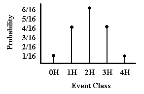

# Intro Articles

## Statistical Analyses | Understanding Statistical Significance Tests

### Purpose of a Statistical Significance Test

A statistical significance (or null hypothesis significance) test is decision-making procedure. At its simplest, it uses the probability of an outcome to decide whether a hypothesis is reasonable.

A hypothesis is a statement regarding the outcome of a particular study. Most importantly, hypothesis testing focuses on the *null hypothesis*. The null hypothesis is the testable prediction that most often states that no true difference exists between groups or between a sample and the population. In other words, the null hypothesis is the opposite of the *alternative hypothesis*, the statement of what you might truly expect or wish to find.

In general, the test of a hypothesis is a question of conditional probability. The question is: What is the probability of my results assuming that the null hypothesis is true? If the probability is very low, we can then question whether the null hypothesis really is reasonable; that is we reject the null hypothesis. If the probability is high, we do not question the viability of the null; that is, we fail to reject the null hypothesis.

### Significance Tests Need Sampling Distributions

A *sampling distribution* is a theoretical probability distribution of all possible values of a sample statistic. In statistical terms, we are looking for the sample space – the set of all possible outcomes – and the probabilities of each of these outcomes.

Sometimes we can exactly specify the sampling distribution. For example, if we toss 4 fair coins, we can determine the sample space and the probability of each event class within the sample space using basic rules of probability. This produces a discrete sampling distribution that can be represented graphically as a probability distribution (see diagram below).

<kbd></kbd>

In many other cases, however, the sample space cannot be so accurately specified because there are a very large number of possible outcomes. In these cases, we have a continuous curve that approximately represents the true sampling distribution. For example, there are many possible means of a variable in a study and we therefore use a continuous curve to represent this sampling distribution (see second diagram on the right).

Also worth noting is that different types of events, outcomes, or statistics produce different sampling distributions. Some sampling distributions will look like those on the right, but others will not. Don&#39;t worry, though, because statisticians have already calculated all of these sampling distributions for you. In fact, the characteristics of the independent and dependent variables determine the statistics and sampling distributions that should be used in order to assess significance.

<kbd></kbd>
 

The overarching important point is that because the sampling distribution represents the probabilities of all possible study outcomes, we can then use it to figure out where any one particular outcomes lies on it. Some outcomes will have higher probabilities (they are consistent with the null hypothesis) and other outcomes will have much lower probabilities (they are less consistent with the null hypothesis).
