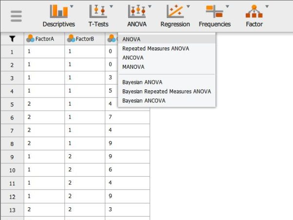
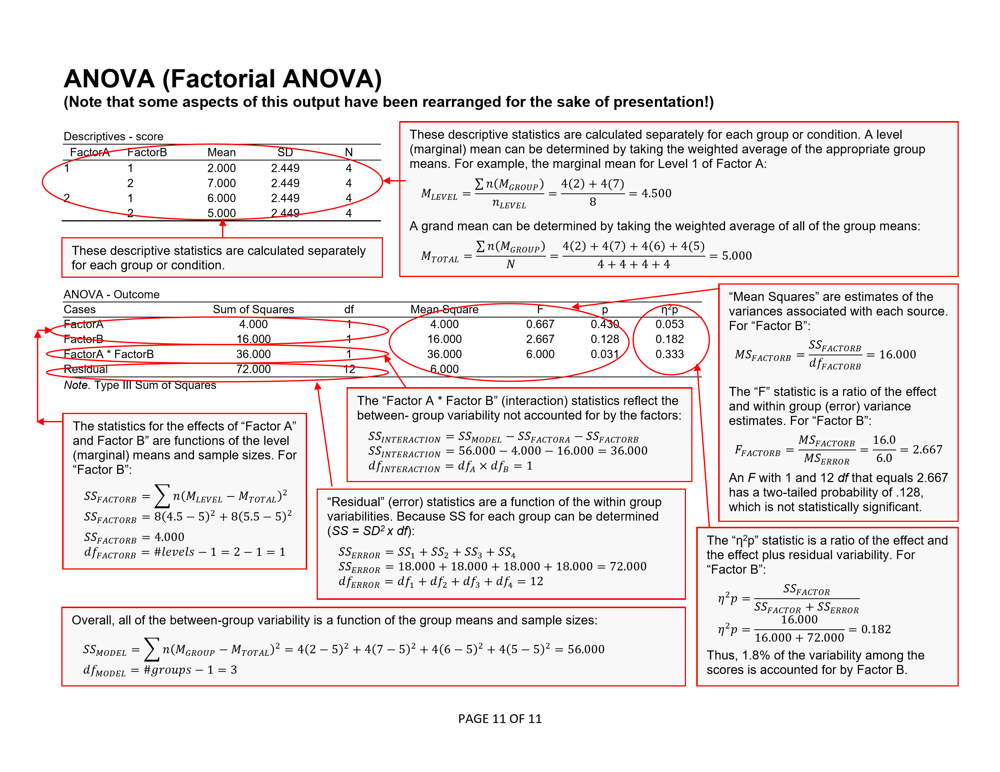
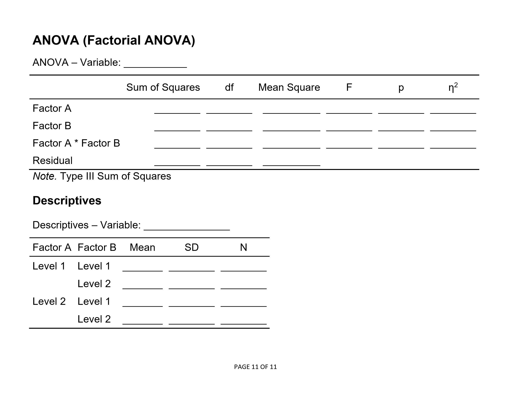

# Statistics for Social Science

### Using and Understanding JASP

---

## Using the Software

[**Using the Software:**](./using-software/) This section provides step-by-step instructions on how to obtain basic statistical output using JASP, both visually with screenshots and via written instructions. Simple examples for most undergraduate-level between-subjects and within-subjects research designs are provided.

<kbd></kbd>

## Annotated Output

[**Annotated Output:**](./annotated-output/) This chapter is intended to facilitate the connection between standard introductory statistics concepts and their implementation in JASP. It shows the output from various types of analyses, describes how to interpret the output, and shows the link between hand calculation formulas and JASP output. Results derive from the examples in the previous chapter of this project.

<kbd></kbd>

## Blank Output

[**Blank Output:**](./blank-output/) This chapter is used as worksheets for class problems. Students fill in their answers on these sheets, thus making clear the links between non-computer (“hand”) calculations and the JASP output.

<kbd></kbd>

