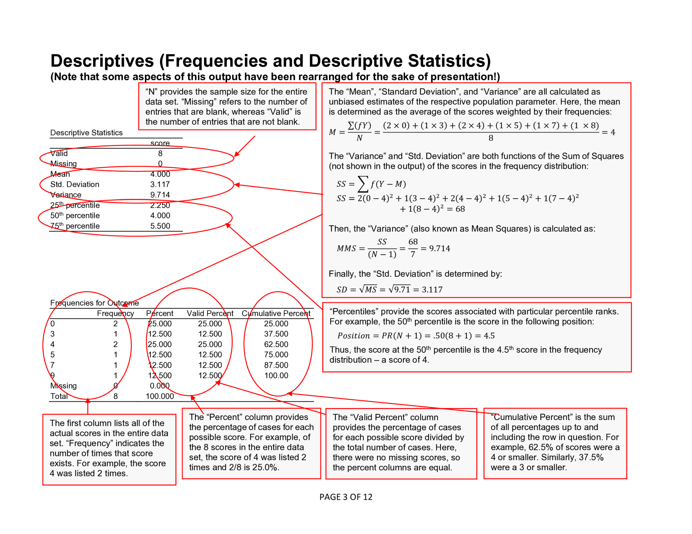
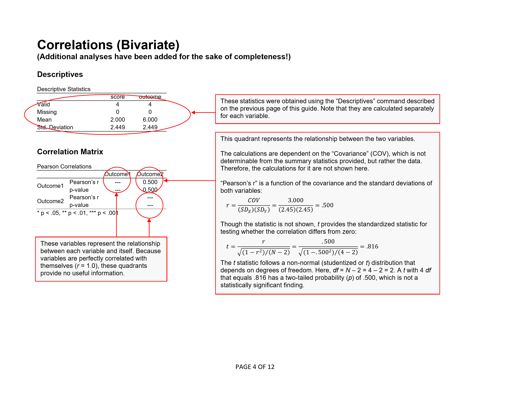
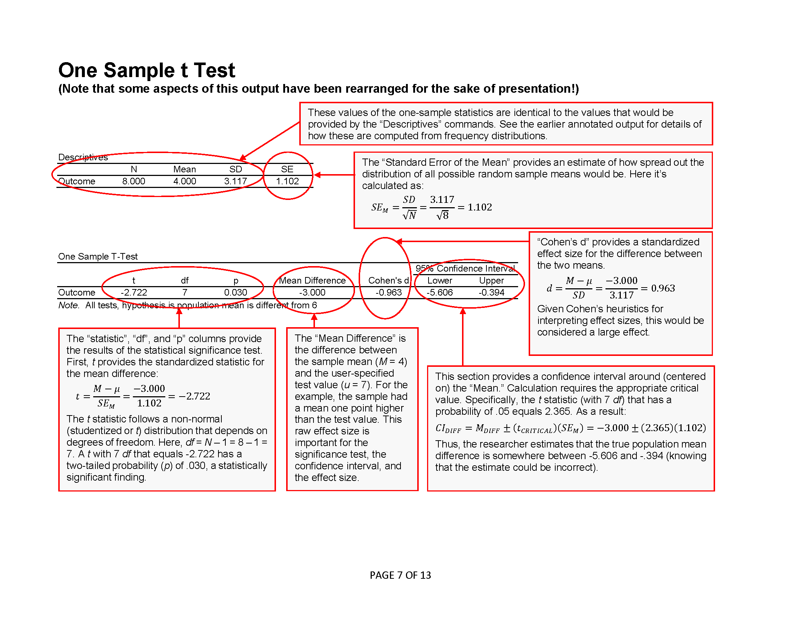
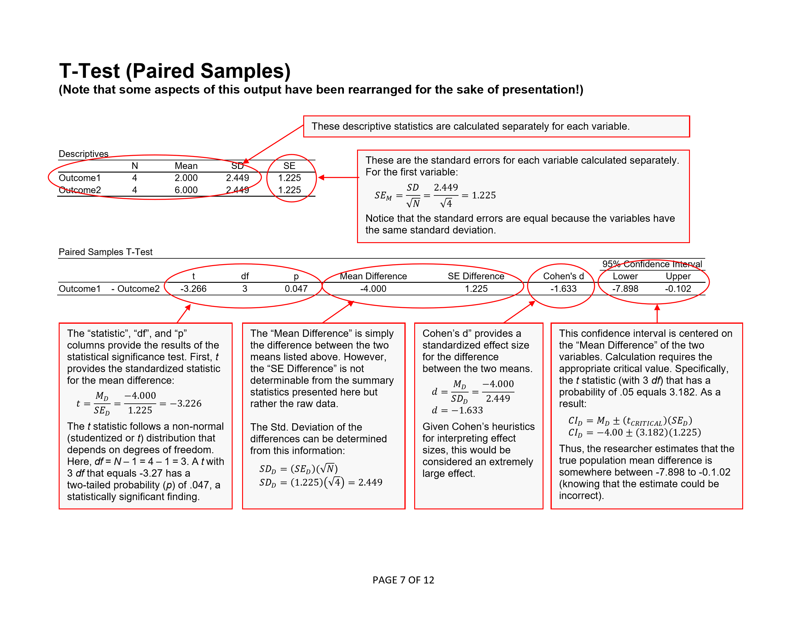
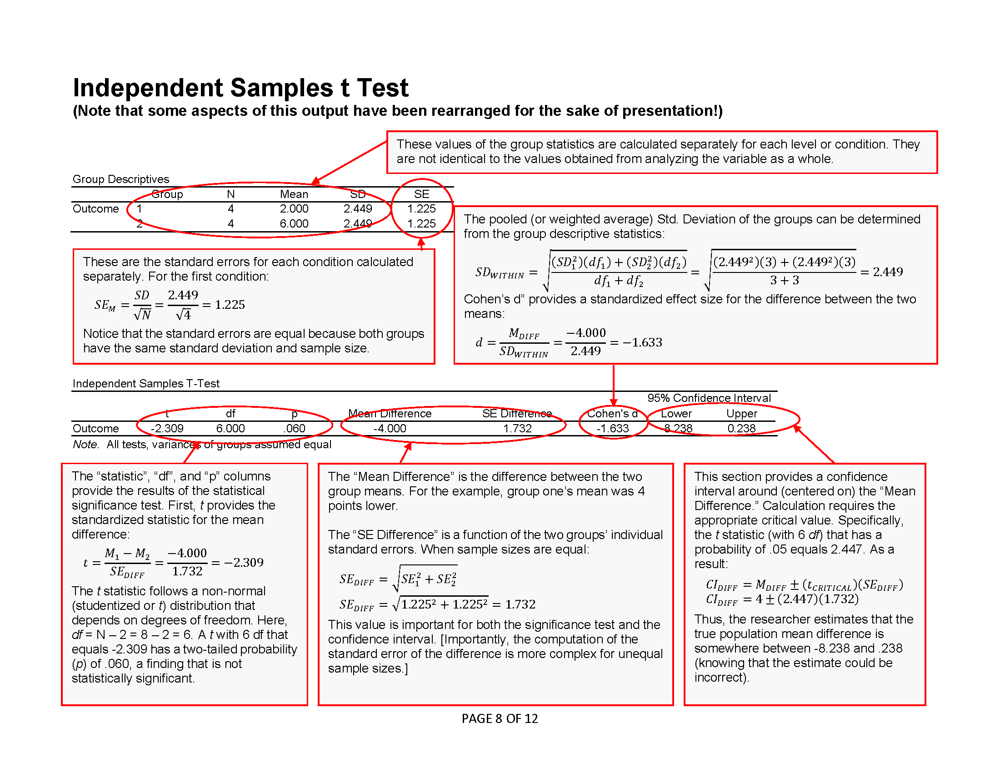
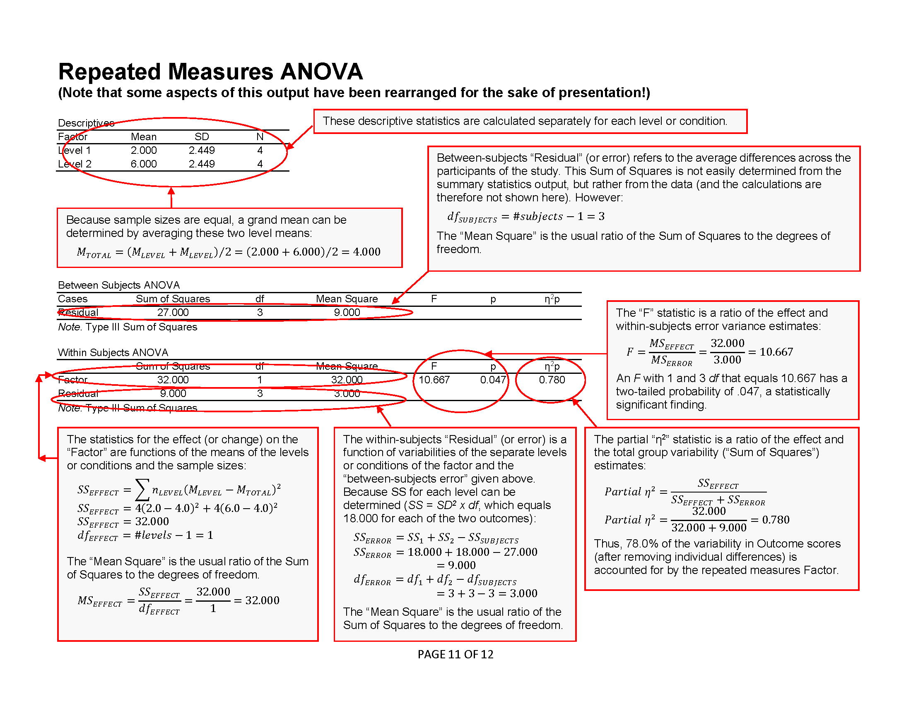
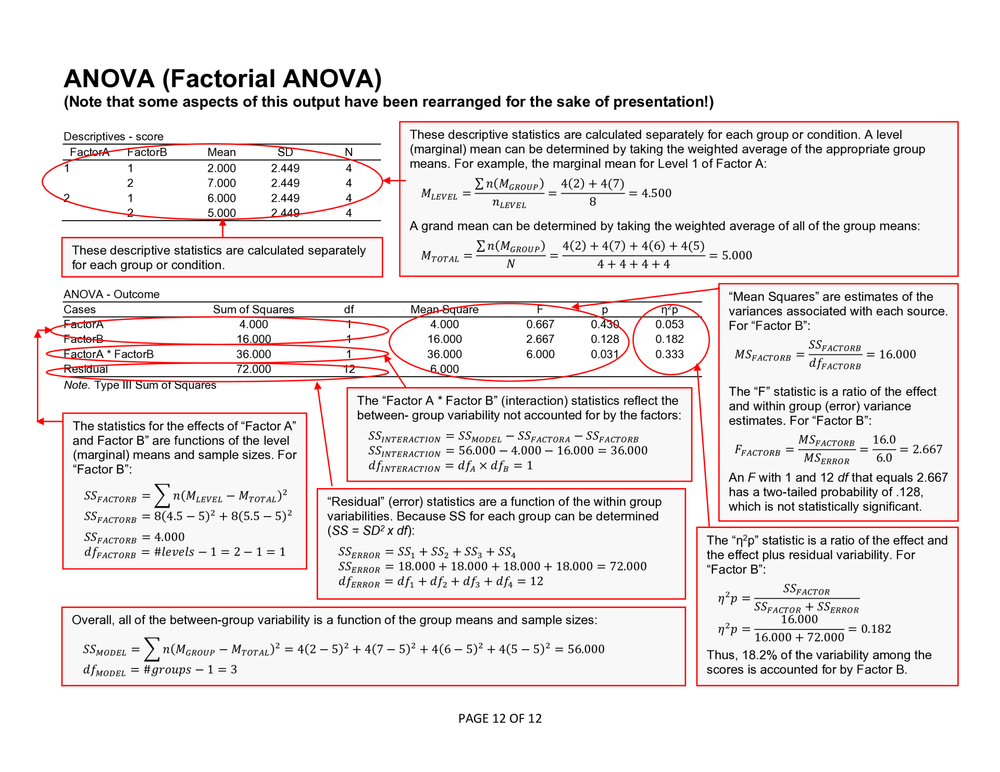

# JASP | Annotated Output

## Descriptives

<kbd></kbd>

## Correlations

<kbd></kbd>

## Confidence Intervals

<kbd></kbd>

## One Sample t Test

<kbd></kbd>

## Paired Samples t Test

<kbd></kbd>

## Independent Samples t Test

<kbd></kbd>

## OneWay ANOVA

<kbd></kbd>

## Post Hoc Comparisons

<kbd></kbd>

## Repeated Measures ANOVA

<kbd></kbd>

## Factorial ANOVA

<kbd></kbd>

