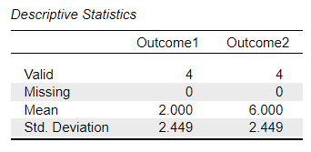
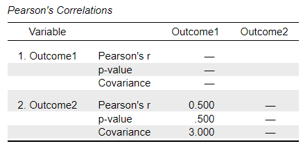

# [JASP Articles](../index.md)

## Annotated Output | Correlations

### Computer Output

The table of descriptive statistics can be used to assist in calculating the correlation.

{: .output}

The table of inferential statistics shows the key elements to be calculated.

{: .output}

### Calculations

Descriptive Statistics: The descriptive statistics are calculated separately for each variable.

Sum of Cross Products: The Sum of Cross Products ("SCP") is not easily determined solely from the summary statistics of the output, but rather from the data.

> $$ SCP = \sum ( X - M_X ) ( Y - M_Y ) = ( 0 - 2.000 ) ( 4 - 6.000 ) + ( 0 - 2.000 )( 7 - 6.000 ) + ( 3 - 2.000 )( 4 - 6.000 ) + (5 - 2.000)(9 - 6.000) = 9.000 $$

Covariance: The Covariance ("COV") is a function of the Sum of Cross Products and the sample size:

> $$ COV = \frac{SCP}{(N - 1)} = \frac{9.000}{(4 - 1)} = 3.000 $$

Pearson Correlation Coefficient: The Pearson Correlation Coefficient ("r") is a function of the Covariance and the Standard Deviations of both variables:

> $$ r = \frac{COV}{(SD_X) (SD_Y)} = \frac{3.000}{(2.449) (2.449)} = .500 $$

### APA Style

Correlations provide a measure of statistical relationship between two variables. 

> For the participants (*N* = 4), the scores on Outcome 1 (*M* = 2.00, *SD* = 2.45) and Outcome 2 (*M* = 6.00, *SD* = 2.45) were moderately correlated, *r*(2) = .50.

Note that correlations can also have inferential information associated with them (and that this information should be summarized if it is available and of interest).

> For the participants (*N* = 4), the scores on Outcome 1 (*M* = 2.00, *SD* = 2.45) and Outcome 2 (*M* = 6.00, *SD* = 2.45) were moderately but not statistically significantly correlated, *r*(2) = .50, 95% CI [-0.89, 0.99], *p* = .500.
