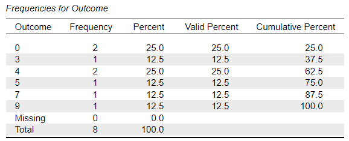
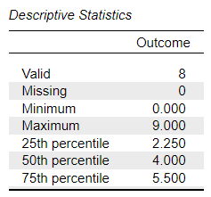

# [JASP Articles](../index.md)

## Annotated Output | Frequencies

### Computer Output

The frequency distribution can be used to determine the percentiles and other statistics.

{: .output}

The table of descriptive statistics shows the key elements to be calculated.

{: .output}
 

### Calculations

Frequency Table: The frequency table provides information about the scores in the data set and the numbers (and percentages) of times those scores occurred.

> The “Valid” column lists all the actual scores in the entire data set. “Frequency” indicates the number of times that score exists. For example, the score of 4 was listed 2 times.  
> The “Percent” column provides the percentage of cases for each possible score. For example, of the 8 scores in the entire data set, the score of 4 was listed 2 times and 2/8 is 25.0%.  
> The “Valid Percent” column provides the percentage of cases for each possible score divided by the total number of cases. Here, there were no missing scores, so the percent columns are equal.  
> “Cumulative Percent” is the SUM of all percentages up to and including the row in question. For example, 62.5% of scores were 4 or less. Similarly, 37.5% were 3 or less.

Percentiles: Percentiles provide the scores associated with particular percentile ranks. The "50th percentile" (the Median) and the "25th percentile" and 75th percentile" (collectively known as the Interquartile Range) are the most commonly calculated.

> For example, the 50th percentile is the score in the following position:
>
> $$ \text{Position} = PR ( N + 1 ) = .50 ( 8 + 1 ) = 4.5 $$
>
> Thus, the score at the 50th percentile is the 4.5th score in the frequency distribution – a score of 4.
> Similarly, a score of 2.25 is at the 25th percentile and a score of 5.50 is at the 75th percentile. Importantly, in some cases, the score values are non-integer interpolated values.

### APA Style

Though often not reported, simple summary statistics like the median and quartiles provide the reader with basic frequency information about the variable under investigation. Both of the following versions present the required information, though the second focuses more on the interpretation of the statistic.

> For the eight participants, Outcome scores of 2.25, 4.00, and 5.50 represented the 25th, 50th, and 75th percentiles, respectively.

> The participants (*N* = 8) had a low *Mdn* Outcome score of 4.00 (*IQR* = 2.25 – 5.50).
