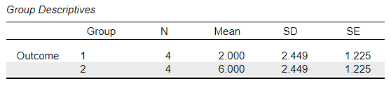
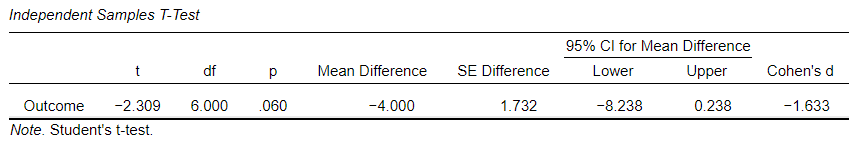

# [JASP Articles](../index.md)

## Annotated Output | Independent Samples t Test

### Computer Output

The table of descriptive statistics can be used to determine the inferential statistics.

{: .output}

The table of inferential statistics shows the key elements to be calculated.

{: .output}

### Calculations

Descriptive Statistics: The values of the group statistics are calculated separately for each level or condition. They are not identical to the values obtained from analyzing the variable as a whole.

Mean Difference (Raw Effect): The "Mean Difference" is the difference between the two sample means (raw effect).

> $$ M_{DIFF} = M_1 - M_2 = 2.000 − 6.000 = −4.000 $$

Within Groups Statistics: When multiple groups are used, it is necessary to get an estimate of the pooled (combined) within group variabilities.

> $$ SS_1 = ( SD_1^2 ) ( df_1) = ( 2.44949^2 ) ( 3 ) = 18.000 $$
>
> $$ SS_2 = ( SD_2^2 ) ( df_2) = ( 2.44949^2 ) ( 3 ) = 18.000 $$
>
> $$ SS_{WITHIN} = SS_1 + SS_ 2 = 18.000 + 18.000 = 36.000 $$
>
> $$ df_{WITHIN} = df_1 + df_ 2 = 3 + 3 = 6 $$
>
> $$ MS_{WITHIN} = \frac{SS_{WITHIN}}{df_{WITHIN}} = \frac{36.000}{6} = 6.000 $$
>
> $$ SD_{WITHIN} = \sqrt{MS_{WITHIN}} = \sqrt{6.000} = 2.449 $$

Standard Error of the Difference: The "Standard Error of the Difference" is a function of the two groups’ individual standard errors. 

> When the two sample sizes are equal:
>
> $$ SE_{DIFF} = \sqrt{ SE_1^2 + SE_2^2 } = \sqrt{ 1.225^2 + 1.225^2 } = 1.732 $$

> Or an expanded version of the formula can be used when the two sample sizes are either equal or unequal:
>
> $$ SE_{DIFF} = \sqrt{ \left( \frac{MS_{WITHIN}}{n_1} \right) + \left( \frac{MS_{WITHIN}}{n_2} \right) } = \sqrt{ \left( \frac{6.000}{4} \right) + \left( \frac{6.000}{4} \right) } = 1.732 $$

Statistical Significance: The "t" statistic is the ratio of the mean difference (raw effect) to the standard error of the difference.

> $$ t = \frac{M_{DIFF}}{SE_{DIFF}} = \frac{-4.000}{1.732} = -2.309 $$
>
> $$ df = ( n_1 - 1 ) + ( n_2 - 1) = N - 2 = 8 - 2 = 6  $$
>
> With *df* = 6, *tCRITICAL* = 2.447  
> Because *t* < *tCRITICAL*, *p* > .05  
> This would not be considered a statistically significant finding.

Confidence Interval: For this test, the appropriate confidence interval is around (centered on) the mean difference (raw effect).

> $$ CI_{DIFF} = M_{DIFF} \pm (t_{CRITICAL}) ( SE_{DIFF}) = -4.000 \pm (2.447) (1.732) = [ −8.238, 0.238 ] $$
>
> Thus, the researcher concludes that the true population mean difference is somewhere between -8.238 and -0.238 (knowing that the estimate could be wrong).

Effect Size: Cohen’s *d* Statistic provides a standardized effect size for the difference between the two means.

> $$ d = \frac{M_{DIFF}}{SD_{WITHIN}} = \frac{-4.000}{2.449} = -1.630 $$
>
> Given Cohen's heuristics for interpreting effect sizes, this would be considered an extremely large effect.

### APA Style

For this analysis, the emphasis is on comparing the means from two groups. Here again the summary and the inferential statistics focus on the difference. The first example focuses on statistical significance testing, whereas the second version includes and emphasizes interpretation of the confidence interval and effect size. 

> An independent samples *t* test showed that the difference in Outcome scores between the first group (*n* = 4, *M* = 4.00, *SD* = 2.45) and the second group (*n* = 3, *M* = 6.00, *SD* = 2.45) was not statistically significant, *t*(6) = -2.31, *p* = .060, 95% CI [-8.24, 0.24], *d* = -1.63.

> Analyses revealed a potentially large, yet inconclusive, difference in Outcome scores between the first group (*n* = 4, *M* = 4.00, *SD* = 2.45) and the second group (*n* = 3, *M* = 6.00, *SD* = 2.45), 95% CI [-8.24, 0.24], *d* = -1.63, *t*(6) = -2.31, *p* = .060.

Alternatively, the means, standard deviations, and confidence intervals could be presented in a table or figure associated with this text.
