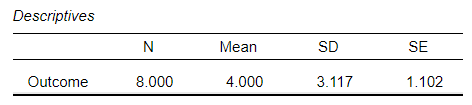
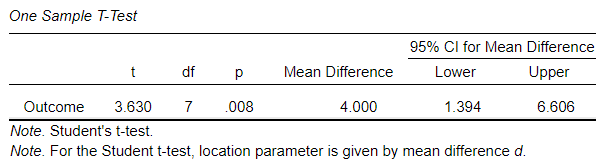

# [JASP Articles](../index.md)

## Annotated Output | Confidence Interval for a Mean

### Computer Output

The table of descriptive statistics can be used to determine the inferential statistics.

The table of inferential statistics shows the key elements to be calculated.

### Calculations

Descriptive Statistics: The values of the one-sample statistics are identical to the values that would be provided by the “Descriptives” procedure.

Standard Error of the Mean: The standard error of the mean provides an estimate of how spread out the distribution of all possible random sample means would be.

> $$ SE_M = \frac{SD}{\sqrt{N}} = \frac{3.117}{\sqrt{8}} = 1.102 $$

Confidence Interval for the Mean: For this analysis, the appropriate confidence interval is around (centered on) the mean.

> With *df* = 7, *tCRITICAL* = 2.365
>
> $$ CI_M = M \pm (t_{CRITICAL}) (SE_M) = 4.000 \pm (2.365) (1.102) = [ 1.394, 6.606 ] $$
>
> Thus, the researcher concludes that the true population mean is somewhere between 1.394 and 6.606 (knowing that the estimate could be incorrect).

### APA Style

Confidence intervals provide a range estimate for a population value (e.g., the mean). Note that the width of the interval can be altered to reflect the level of confidence in the estimate. Both of the following versions present the required information, though the second focuses more on the interpretation of the statistic.

> The eight participants had a mean Outcome score of 4.00 (SD = 3.12), 95% CI [1.39, 6.61].

> The participants (*N* = 8) scored low on the Outcome (M = 4.00, SD = 3.12), 95% CI [1.39, 6.61].
