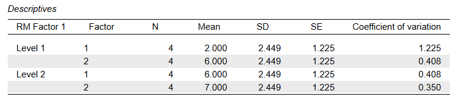
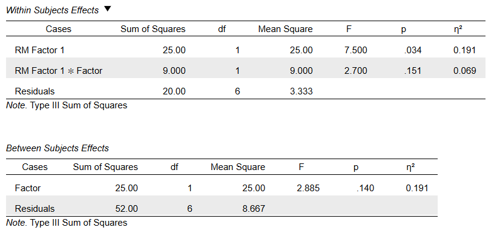

# [JASP Articles](../index.md)

## Annotated Output | Mixed ANOVA

### Computer Output

The table of descriptive statistics can be used to determine the inferential statistics.

{: .output}

The table of inferential statistics shows the key elements to be calculated.

{: .output}

### Calculations

Descriptive Statistics: The descriptive statistics are calculated separately for each group or condition.

Grand (or Total) Mean: A grand mean can be determined by taking the weighted average of all of the group means.

> $$ M_{TOTAL} = \frac{\sum n_{GROUP} (M_{GROUP})}{N} = \frac{ 4 (2.000) + 4 (6.000) + 4 (6.000) + 4 (7.000) }{( 4 + 4 + 4 + 4 )} = 5.250 $$

Subject Means: Each subject in the study would have an average score across the time points.

> $$ M_{S1} = \frac{0.000 + 4.000}{2} = 2.000 $$
>
> $$ M_{S2} = \frac{0.000 + 7.000}{2} = 3.500 $$
>
> $$ M_{S3} = \frac{3.000 + 4.000}{2} = 3.500 $$
>
> $$ M_{S4} = \frac{5.000 + 9.000}{2} = 7.000 $$
>
> $$ M_{S5} = \frac{4.000 + 9.000}{2} = 6.500 $$
>
> $$ M_{S6} = \frac{7.000 + 6.000}{2} = 6.500 $$
>
> $$ M_{S7} = \frac{4.000 + 4.000}{2} = 4.000 $$
>
> $$ M_{S8} = \frac{9.000 + 9.000}{2} = 9.000 $$

Marginal Means: A level (marginal) mean can be determined by taking the weighted average of the appropriate group means.

> For Factor: 
> 
> $$ M_{FACTOR1} = \frac{\sum n_{GROUP} (M_{GROUP})}{N_{LEVEL}} = \frac{ 4 (2.000) + 4 (6.000) }{( 4 + 4 )} = 4.000 $$
>
> $$ M_{FACTOR2} = \frac{\sum n_{GROUP} (M_{GROUP})}{N_{LEVEL}} = \frac{ 4 (6.000) + 4 (7.000) }{( 4 + 4 )} = 6.500 $$

> For Time: 
> 
> $$ M_{TIME1} = \frac{\sum n_{GROUP} (M_{GROUP})}{N_{LEVEL}} = \frac{ 4 (2.000) + 4 (6.000) }{( 4 + 4 )} = 4.000 $$
>
> $$ M_{TIME2} = \frac{\sum n_{GROUP} (M_{GROUP})}{N_{LEVEL}} = \frac{ 4 (6.000) + 4 (7.000) }{( 4 + 4 )} = 6.500 $$

Between-Subjects Error Statistics: Between-subjects error refers to average differences across the participants within each Factor level. 

> $$ SS_{ERROR(BETWEEN)} = \sum (\text{number of Time points}) (M_{SUBJECT} - M_{FACTOR\;LEVEL})^2 = \left[2(2.000-4.000)^2 + 2(3.500-4.000)^2 + 2(3.500-4.000)^2 + 2(7.000-4.000)^2\right] + \left[2(6.500-6.500)^2 + 2(6.500-6.500)^2 + 2(4.000-6.500)^2 + 2(9.000-6.500)^2\right] = 52.000 $$
>
> $$ df_{ERROR(BETWEEN)} = (\text{# levels of Factor})(\text{# subjects per level} - 1) = (2)(4-1) = 6 $$
>
> $$ MS_{ERROR(BETWEEN)} = \frac{SS_{ERROR(BETWEEN)}}{df_{ERROR(BETWEEN)}} = \frac{52.000}{6} = 8.667 $$

Within-Subjects Variability: The within-subjects variability reflects person-by-time variability. 

> $$ SS_{SUBJECTS} = \sum (Y - M_{SUBJECT})^2 = (0-2)^2 + (4-2)^2 + (0-3.5)^2 + (7-3.5)^2 + (3-3.5)^2 + (4-3.5)^2 + (5-7)^2 + (9-7)^2 + (4-6.5)^2 + (9-6.5)^2 + (7-6.5)^2 + (6-6.5)^2 + (4-4)^2 + (4-4)^2 + (9-9)^2 + (9-9)^2 = 54.000 $$
>
> $$ df_{SUBJECTS} = (\text{number of subjects})(\text{# time points} - 1) = (8)(2-1) = 8 $$

Between-Subjects Effect Statistics: The between-subjects effect (Factor) is a function of the marginal means and sample sizes.

> $$ SS_{FACTOR} = \sum n_{LEVEL} (M_{LEVEL} - M_{TOTAL})^2 = 8(4.000 - 5.250)^2 + 8(6.500 - 5.250)^2 = 25.000 $$
>
> $$ df_{FACTOR} = \text{# levels of Factor} - 1 = 2 - 1 = 1 $$
>
> $$ MS_{FACTOR} = \frac{SS_{FACTOR}}{df_{FACTOR}} = \frac{25.000}{1} = 25.000 $$

Within-Subjects Effect Statistics: The within-subjects effects include the main effect of Time and the Factor × Time interaction.
>
> For Time: 
> 
> $$ SS_{TIME} = \sum n_{LEVEL} (M_{LEVEL} - M_{TOTAL})^2 = 8(4.000 - 5.250)^2 + 8(6.500 - 5.250)^2 = 25.000 $$
>
> $$ df_{TIME} = \text{# levels of Time} - 1 = 2 - 1 = 1 $$
>
> $$ MS_{TIME} = \frac{SS_{TIME}}{df_{TIME}} = \frac{25.000}{1} = 25.000 $$

> For the Interaction:  
>
> $$ SS_{INTERACTION} = \sum n_{GROUP} (M_{GROUP} - M_{FACTOR} - M_{TIME} + M_{TOTAL})^2 = 4(2.000 - 4.000 - 4.000 + 5.250)^2 + 4(6.000 - 4.000 - 4.000 + 5.250)^2 + 4(6.000 - 6.500 - 4.000 + 5.250)^2 + 4(7.000 - 6.500 - 6.500 + 5.250)^2 = 9.000 $$
>
> $$ df_{INTERACTION} = (\text{# levels of Factor} - 1)(\text{# levels of Time} - 1) = (2 - 1)(2 - 1) = 1 $$
>
> $$ MS_{INTERACTION} = \frac{SS_{INTERACTION}}{df_{INTERACTION}} = \frac{9.000}{1} = 9.000 $$

Within-Subjects Error Statistics: After removing the Time effect and the Interaction effect from the total within-subjects variability, the remaining variation is the within-subjects error term.

> $$ SS_{ERROR(WITHIN)} = SS_{SUBJECTS} - SS_{TIME} - SS_{INTERACTION} = 54.000 - 25.000 - 9.000 = 20.000 $$
>
> $$ df_{ERROR(WITHIN)} = df_{SUBJECTS} - df_{TIME} - df_{INTERACTION} = 8 - 1 - 1 = 6 $$
>
> $$ MS_{ERROR(WITHIN)} = \frac{SS_{ERROR(WITHIN)}}{df_{ERROR(WITHIN)}} = \frac{20.000}{6} = 3.333 $$

Statistical Significance: Each *F* statistic is the ratio of an effect mean square to its corresponding error mean square in the correct stratum.

> For the Factor Main Effect: 
> 
> $$ F_{FACTOR} = \frac{MS_{FACTOR}}{MS_{ERROR(BETWEEN)}} = \frac{25.000}{8.667} = 2.885 $$
>
> With *dfFACTOR* = 1 and *dfERROR(BETWEEN)* = 6, *p* = .140  
> This would not be considered a statistically significant finding.

> For the Time Main Effect:
>  
> $$ F_{TIME} = \frac{MS_{TIME}}{MS_{ERROR(WITHIN)}} = \frac{25.000}{3.333} = 7.500 $$
>
> With *dfTIME* = 1 and *dfERROR(WITHIN)* = 6, *p* = .034  
> This would be considered a statistically significant finding.

> For the Interaction: 
> 
> $$ F_{INTERACTION} = \frac{MS_{INTERACTION}}{MS_{ERROR(WITHIN)}} = \frac{9.000}{3.333} = 2.700 $$
>
> With *dfINTERACTION* = 1 and *dfERROR(WITHIN)* = 6, *p* = .152  
> This would not be considered a statistically significant finding.

Effect Size: The partial eta-squared statistic is a ratio of each effect Sum of Squares and the remaining variability after that effect's corresponding error term has been partialled out.

> For the Factor Main Effect:
>  
> $$ \text{Partial} \; \eta^2 = \frac{SS_{FACTOR}}{( SS_{FACTOR} + SS_{ERROR(BETWEEN)} )} = \frac{25.000}{( 25.000 + 52.000 )} = 0.325 $$
>
> Thus, 32.5% of the variability among the scores is accounted for by Factor.

> For the Time Main Effect:
>  
> $$ \text{Partial} \; \eta^2 = \frac{SS_{TIME}}{( SS_{TIME} + SS_{ERROR(WITHIN)} )} = \frac{25.000}{( 25.000 + 20.000 )} = 0.556 $$
>
> Thus, 55.6% of the variability among the scores is accounted for by Time.

> For the Interaction:  
>
> $$ \text{Partial} \; \eta^2 = \frac{SS_{INTERACTION}}{( SS_{INTERACTION} + SS_{ERROR(WITHIN)} )} = \frac{9.000}{( 9.000 + 20.000 )} = 0.310 $$
>
> Thus, 31.0% of the variability among the scores is accounted for by the Factor × Time interaction.

Confidence Intervals: For Mixed ANOVA, calculate the confidence intervals around (centered on) each mean separately (not shown here).

### APA Style

The mixed ANOVA provides statistics for the main effects and interaction in a mixed design. Each effect is summarized below in APA style, using the actual R output values:

> A 2 (Factor) × 2 (Time) mixed ANOVA showed that the small main effect of Factor was not statistically significant, *F*(1,6) = 2.89, *p* = .140, partial *η*2 = .33, nor was the moderately sized interaction, *F*(1,6) = 2.70, *p* = .152, partial *η*2 = .31. However, the large main effect of Time was statistically significant, *F*(1,6) = 7.50, *p* = .034, partial *η*2 = .56.

Typically, the means, standard deviations, and confidence intervals would be presented in a table or figure associated with this text.
