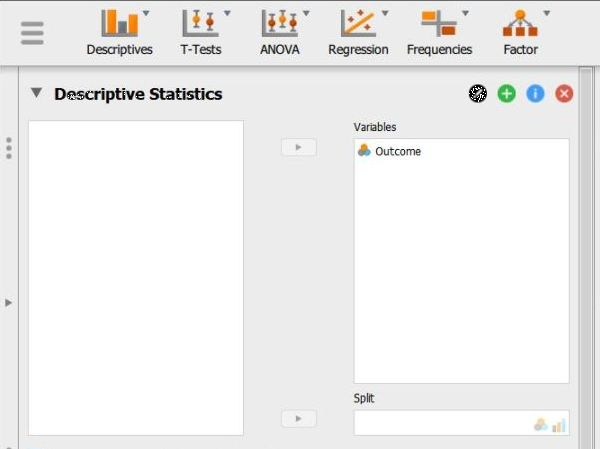
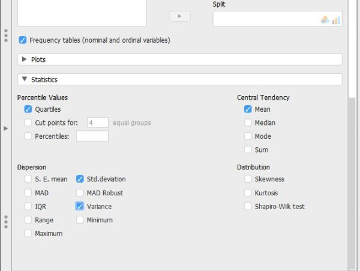
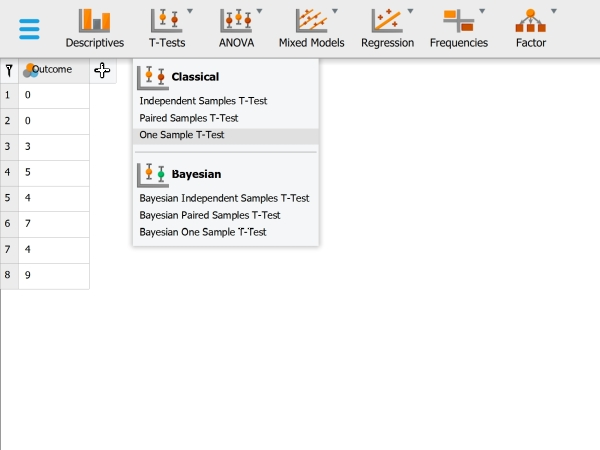
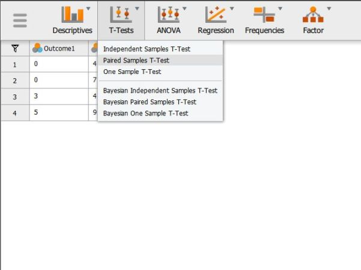
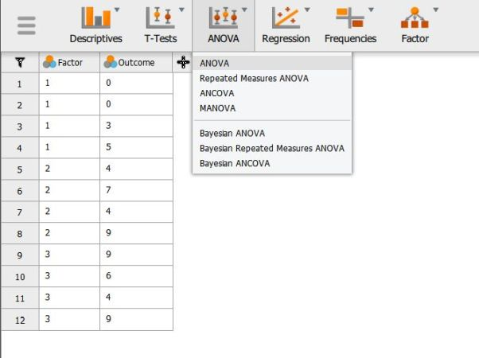
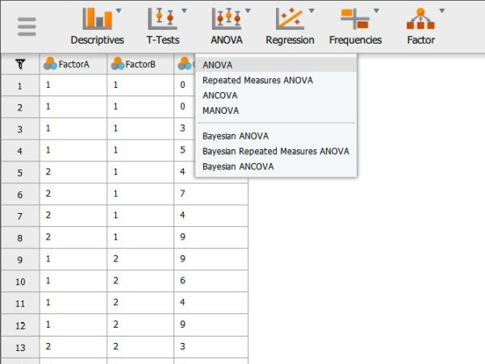
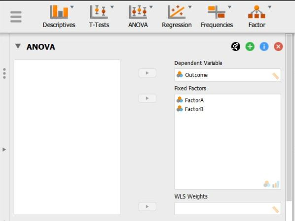

# JASP | Data Analysis

## Descriptives (Frequencies and Descriptive Statistics) 

### Obtaining Frequency-Related Statistics

1. First, load the data file previously created (described elsewhere). Be sure that the data file looks as you intended. 

2. Select the "Descriptives → Descriptive Statistics" option.

<kbd></kbd>

### Obtaining a Frequency Distribution

3. A set of options will then appear for you to choose the variables and statistics of interest.

4. Select the variables you wish to analyze by clicking on them in the left-hand box and then the arrow to move them into the right-hand box.

5. Be sure that "Display frequency tables" is checked. Without this checked, you will not get a frequency distribution.

6. Output will automatically appear on the right side of the window. 

<kbd></kbd>

### Obtaining Summary Statistics

7. Though some basic summary statistics are displayed by default, you can make changes by expanding the "Statistics" drop-down menu.

8. As you select the desired statistics, the output on the right side of the window will be automatically updated. 

9. Individual tables (or even the whole section of Output) can be copied using the drop-down arrow options in the output. These can be pasted into word processing software for printing purposes.

<kbd></kbd>

## Correlations (Bivariate) 

### Obtaining Correlational Statistics

1. First, load the data file containing multiple variables that you previously created (described elsewhere). Be sure that the data file looks as you intended. 

2. Select the "Regression → Correlation Matrix" option.

<kbd></kbd>

### Obtaining the Correlations (and Significance Tests)

3. A set of options will then appear for you to choose the variables and statistics of interest.

4. Select the variables you wish to analyze by clicking on them in the left-hand box and then the arrow to move them into the right-hand box. 

5. Output (with no descriptive statistics) will automatically appear on the right side of the window. Output can be copied and pasted into other software for printing.

6. If you wish descriptive statistics associated with each variable, follow the "Descriptives" procedures described earlier in this manual.

<kbd></kbd>

## T Test (Confidence Intervals) 

### Obtaining One-Sample Inferential Statistics

1. First, load the data file that you previously created (described elsewhere). Be sure that the data file looks as you intended.

2. Select the "T-Tests → One Sample T-Test" option.

<kbd></kbd>

### Choosing the Variable

3. A set of options will then appear for you to choose the variables and statistics of interest.

4. Select the variable you wish to analyze by clicking on it in the left-hand box and then the arrow to move it into the right-hand box. 

5. Output will automatically appear on the right side of the window. Output can be copied and pasted into other software for printing.

<kbd></kbd>

### Obtaining the Statistics

6. To get the confidence interval for the mean, make sure the “Test Value” is set to zero.

7. Check the “Confidence Interval” box (and alter the width of the interval if desired). 

8. Similarly, select other options that are important for you: “Descriptives” will offer a mean and standard deviation for the variable; and “Descriptives plots” will provide a graph of the confidence interval.

9. Updated output will automatically appear on the right side of the window. Output can be copied and pasted into other documents for printing.

<kbd></kbd>

## T Test (One Sample) 

### Obtaining One-Sample Inferential Statistics

1. First, load the data file that you previously created (described elsewhere). Be sure that the data file looks as you intended.

2. Select the "T-Tests → One Sample T-Test" option.

<kbd></kbd>

### Obtaining the Significance Test

3. A set of options will then appear for you to choose the variables and statistics of interest.

4. Select the variable you wish to analyze by clicking on it in the left-hand box and then the arrow to move it into the right-hand box. 

5. Be sure to enter a known or hypothesized mean into the "Test Value" field. If you do not enter a value here, JASP will automatically use zero as the comparison mean.

6. Output will automatically appear on the right side of the window. Output can be copied and pasted into other software for printing.

<kbd></kbd>

### Obtaining Additional Statistics

7. Select the options that are important for you: "Location parameter" will display the size of the difference between the two means; "Effect size" will display Cohen's d; and "Descriptives" will offer a mean and standard deviation for the group. 

8. If you wish to view (and alter) the widths of the confidence intervals, check the relevant "Confidence Interval" boxes. 

9. Updated output will automatically appear on the right side of the window. Output can be copied and pasted into other software for printing.

<kbd></kbd>

## T Test (Paired Samples) 

### Obtaining Paired-Sample Inferential Statistics

1. First, load the paired samples or repeated measures data file that you previously created (described elsewhere). Be sure that the data file looks as you intended. 

2. Select the "T-Tests → Paired Samples T-Test" option. 

<kbd></kbd>

### Obtaining the Significance Test

3. A set of options will then appear for you to choose the variables and statistics of interest.

4. Select the variables you wish to analyze by clicking on both of them while holding down the "CTRL" key. Then click on the arrow to move the pair of variables to the right-hand box.

5. Output will automatically appear on the right side of the window. Output can be copied and pasted into other software for printing.

<kbd></kbd>

### Obtaining Additional Statistics

6. Select the options that are important for you: "Location parameter" will display the size of the difference between the two means; "Effect size" will display Cohen's d; and "Descriptives" will offer means and standard deviations for each variable.

7. If you wish to view (and alter) the widths of the confidence intervals, check the "Confidence Interval" boxes. 

8. Updated output will automatically appear on the right side of the window. Output can be copied and pasted into other software for printing.

<kbd></kbd>

## T Test (Independent Samples) 

### Obtaining Two-Sample Inferential Statistics

1. First, load the two sample data file that you previously created (described elsewhere). Be sure that the data file looks as you intended. 

2. Select the "T-Tests → Independent Samples T-Test" option. 

<kbd></kbd>

### Obtaining the Significance Test

3. A set of options will then appear for you to choose the variables and statistics of interest.

4. Select the outcome variable and click the arrow to move it into the "Dependent Variables" box.

5. Move the Independent Variable to the "Grouping Variable" box. 

6. Output will automatically appear on the right side of the window. Output can be copied and pasted into other software for printing.

<kbd></kbd>

### Obtaining Additional Statistics

7. Select the options that are important for you: "Location parameter" will display the size of the difference between the two group's means; "Effect size" will display Cohen's d; and "Descriptives" will offer means and standard  deviations for each group. 

8. If you wish to view (and alter) the widths of the confidence intervals, check the "Confidence Interval" boxes. 

9. Updated output will automatically appear on the right side of the window. Output can be copied and pasted into other software for printing.

<kbd></kbd>

## ANOVA (OneWay ANOVA) 

### Obtaining Multiple-Sample Inferential Statistics

1. First, load the two sample data file that you previously created (described elsewhere). Be sure that the data file looks as you intended. 

2. Select the "ANOVA → ANOVA" option. 

<kbd></kbd>

### Obtaining the Significance Test

3. A set of options will then appear for you to choose the variables and statistics of interest.

4. Select the outcome variable and click the arrow to move it into the "Dependent  Variable" box. 

5. Move the Factor (Independent Variable) to the "Fixed Factors" box.

6. Output will automatically appear on the right side of the window. Output can be copied and pasted into other software for printing.

<kbd></kbd>

### Obtaining Additional Statistics

7. Though some basic summary  statistics are displayed by default, you can make changes by expanding the "Additional Options" drop-down menu.

8. Move the factor (Independent Variable) name from the left-hand box for "Marginal means" to the right-hand box. 

9. Select options that are important for you: "Estimates of effect size"  will display the chosen statistics; and "Descriptive statistics" will offer means and standard deviations for each group.

10. Updated output will automatically appear on the right side of the window. Output can be copied and pasted into other software for printing.

<kbd></kbd>

## Post Hoc Comparisons (OneWay ANOVA) 

### Obtaining Multiple-Sample Inferential Statistics

1. First, load the two sample data file that you previously created (described elsewhere). Be sure that the data file looks as you intended. 

2. Select the "ANOVA → ANOVA" option. 

<kbd></kbd>

### Obtaining the Significance Test

3. A set of options will then appear for you to choose the variables and statistics of interest.

4. Select the outcome variable and click the arrow to move it into the "Dependent Variable" box. 

5. Move the Factor (Independent Variable) to the "Fixed Factors" box.

6. Output will automatically appear on the right side of the window. Output can be copied and pasted into other software for printing.

<kbd></kbd>

### Obtaining Additional Statistics

7. Though some basic summary statistics are displayed by default, you can make changes by expanding the "Additional Options" drop-down menu.

8. Move the factor (Independent Variable) name from the left-hand box for "Marginal means" to the right-hand box. 

9. Select options that are important for you: "Estimates of effect size" will display the chosen statistics; and "Descriptive statistics" will offer means and standard deviations for each group.

10. Updated output will automatically appear on the right side of the window. Output can be copied and pasted into other software for printing.

<kbd></kbd>

### Obtaining Post Hoc Tests

11. If you wish to obtain post hoc tests for the purpose of making comparisons between groups, click the "Post Hoc Tests" drop-down button. 

12. Move the factor (Independent Variable) name from the left-hand box to the right-hand box.

13. Select "Tukey" to get Tukey HSD post hoc tests (or  whatever option you prefer). 

14. Updated output will automatically appear on the right side of the window. Output can be copied and  pasted into other software for printing.

<kbd></kbd>

## Repeated Measures ANOVA 

### Obtaining Repeated Measures Inferential Statistics

1. First, load the repeated measures data file that you previously created (described elsewhere). Be sure that the data file looks as you intended. 

2. Select the "ANOVA → Repeated Measures ANOVA" option.

<kbd></kbd>

### Labeling the Within-Subjects Variable/Factor

3. A set of options will then appear for you to choose the variables and statistics of interest.

4. In the "Repeated Measures Factors" box, you will define the repeated measures factor. This box is necessary for labeling the repeated measurements of the same underlying factor.

5. Click on "RM Factor 1" and type in the name you wish to give to the repeated measures factor. In this example, the measurements/columns reflect quizzes at two different times so "Time" is used as the name.

6. Below that, click on "Level 1" to type the name of the individual level of the repeated measures factor. You may do the same for each level. In this example, the quiz was given twice, so  there were only 2 levels of the factor.

<kbd></kbd>

### Obtaining the Significance Test

7. In the "Repeated Measures Cells" box, you will indicate which measurements/columns in the data set reflect the instances of the repeated measurements.

8. Select the instances you wish to associate with the factor by clicking on them and then arrow to move them. In this example, "t1score" reflects the first level of the factor and "t2score"  reflects the second level of the factor.

9. Note that this factor only exists in the computer's memory. For examples, nowhere in the data set will you see a variable called "Time."

10. Output will automatically appear on the right side of the window. Output can be copied and pasted into other software for printing.

<kbd></kbd>

### Obtaining Additional Statistics

11. Though some basic summary statistics are displayed by default, you can make changes by expanding the "Additional Options" drop-down menu.

12. Select options that are important for you: "Estimates of effect size" will display the chosen statistics; and "Descriptive statistics" will offer means and standard deviations for each group.

13. Updated output will automatically appear on the right side of the window. Output can be copied and pasted into other software for printing.

<kbd></kbd>

## ANOVA (Factorial ANOVA) 

### Obtaining Factorial Inferential Statistics

1. First, load the factorial data file that you previously created (described elsewhere). Be sure that the data file looks as you intended. 

2. Select the "ANOVA → ANOVA" option. 

<kbd></kbd>

### Obtaining the Significance Test

3. A set of options will then appear for you to choose the variables and statistics of interest.

4. Select the outcome variable and click the arrow to move it into the "Dependent Variable" box. 

5. Move the multiple Factors (Independent Variables) to the "Fixed Factors" box. (The interaction term will be automatically generated in the output.)

6. Output will automatically appear on the right side of the window. Output can be copied and pasted into other software for printing.

<kbd></kbd>

### Obtaining Additional Statistics

7. Though some basic summary statistics are displayed by default, you can make changes by expanding the "Additional Options" drop-down menu.

8. Move the factors (Independent Variable) name from the left-hand box for "Marginal means" to the right-hand box. (If you wish cell means for the factorial design, be sure to move the interaction term as well.) 

9. Select options that are important for you: "Estimates of effect size" will display the chosen statistics; and "Descriptive statistics" will offer means and standard deviations for each group.

10. Updated output will automatically appear on the right side of the window. Output can be copied and pasted into other software for printing.

<kbd></kbd>

