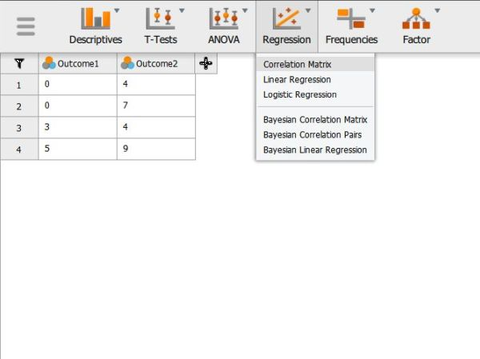

# [JASP Articles](../index.md)

## Data Analysis | Correlations

### Selecting the Analysis

1. First, enter data involving multiple variables (described elsewhere). 

2. In the "Analyses" section of the menu, select the "Regression → Correlation Matrix" option.

{: .screenshot}

### Obtaining Inferential Statistics

3. A set of options will then appear for you to choose the variables and statistics of interest.

4. Select the variables you wish to analyze by clicking on them in the left-hand box and then the arrow to move them into the right-hand box. 

5. Output (with no descriptive statistics) will automatically appear on the right side of the window. 

6. If you wish descriptive statistics associated with each variable, follow the "Descriptives" procedures described earlier in this manual.

{: .screenshot}

