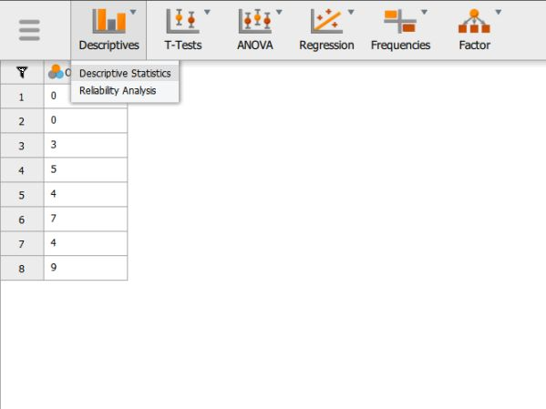
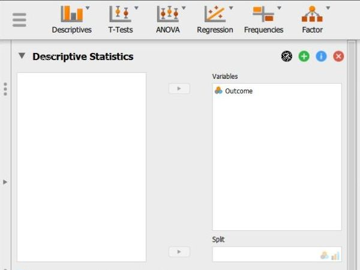

# [JASP Articles](../index.md)

## Data Analysis | Frequencies

### Selecting the Analysis

1. First, enter the data (described elsewhere). 

2. In the "Analyses" section of the menu, select the "Descriptives → Descriptive Statistics" option.

{: .screenshot}

### Obtaining Frequencies

3. A set of options will then appear for you to choose the variables and statistics of interest.

4. Select the variables you wish to analyze by clicking on them in the left-hand box and then the arrow to move them into the right-hand box.

5. Be sure that "Display frequency tables" is checked. Without this checked, you will not get a frequency distribution.

6. Output will automatically appear on the right side of the window. 

{: .screenshot}

### Obtaining Descriptive Statistics

7. Though some basic summary statistics are displayed by default, you can make changes by expanding the "Statistics" drop-down menu.

8. As you select the desired statistics, the output on the right side of the window will be automatically updated. 

{: .screenshot}

