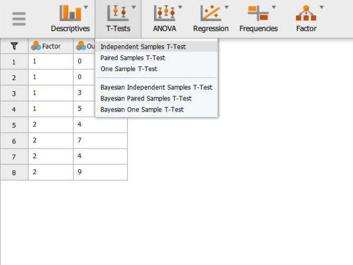
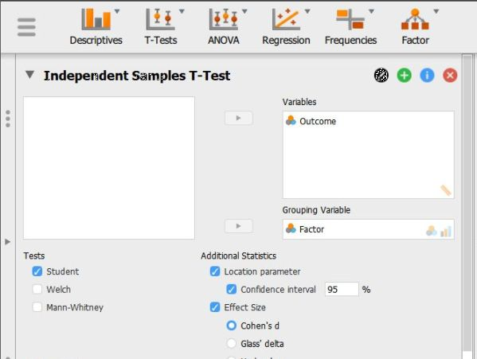
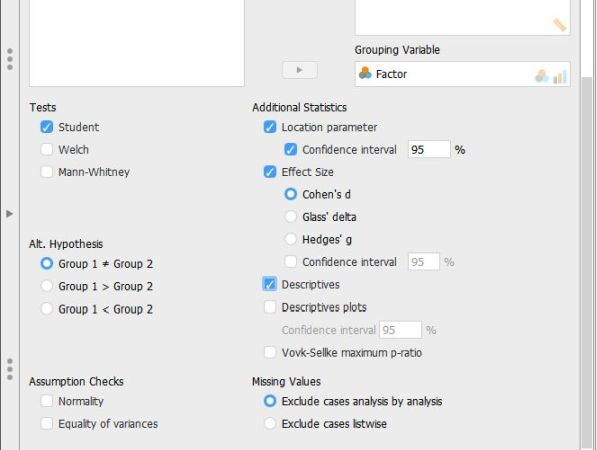

# JASP | Data Analysis

## Independent Samples t Test

### Selecting the Analysis

1. First, load the two sample data file that you previously created (described elsewhere). Be sure that the data file looks as you intended. 

2. Select the "T-Tests → Independent Samples T-Test" option. 

<kbd></kbd>

### Obtaining Inferential Statistics

3. A set of options will then appear for you to choose the variables and statistics of interest.

4. Select the outcome variable and click the arrow to move it into the "Dependent Variables" box.

5. Move the Independent Variable to the "Grouping Variable" box. 

6. Output will automatically appear on the right side of the window. Output can be copied and pasted into other software for printing.

<kbd></kbd>

### Obtaining Additional Statistics

7. Select the options that are important for you: "Location parameter" will display the size of the difference between the two group's means; "Effect size" will display Cohen's d; and "Descriptives" will offer means and standard  deviations for each group. 

8. If you wish to view (and alter) the widths of the confidence intervals, check the "Confidence Interval" boxes. 

9. Updated output will automatically appear on the right side of the window. Output can be copied and pasted into other software for printing.

<kbd></kbd>

