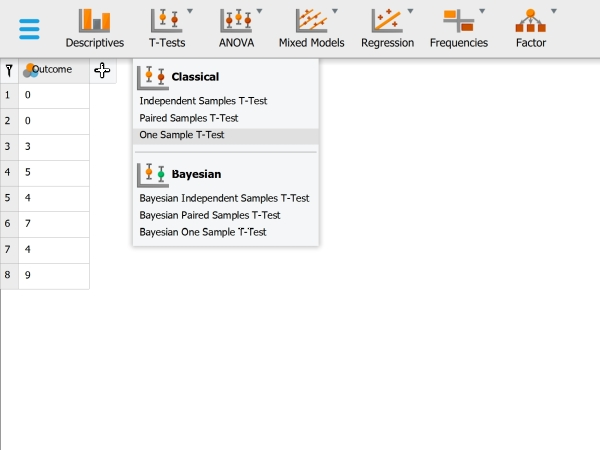
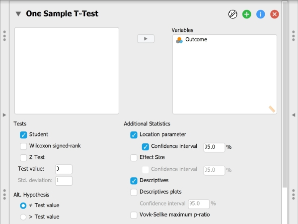
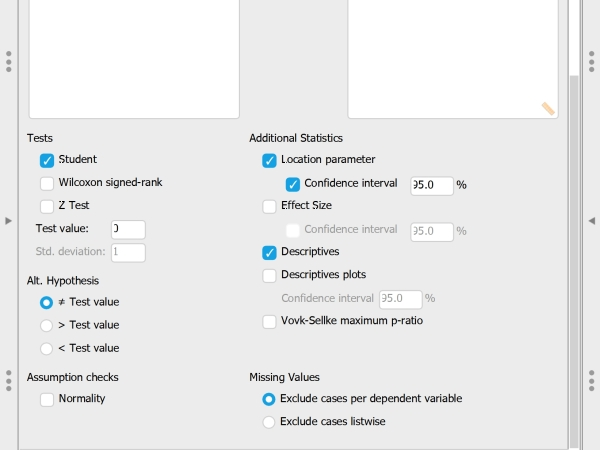

# [JASP Articles](../index.md)

## Data Analysis | Confidence Interval for a Mean

### Selecting the Analysis

1. First, enter the data (described elsewhere). 

2. In the "Analyses" section of the menu, select the "T-Tests → One Sample T-Test" option.

{: .image}

### Choosing Variables

3. A set of options will then appear for you to choose the variables and statistics of interest.

4. Select the variable you wish to analyze by clicking on it in the left-hand box and then the arrow to move it into the right-hand box. 

5. Output will automatically appear on the right side of the window. 

{: .image}

### Obtaining Inferential Statistics

6. To get the confidence interval for the mean, make sure the “Test Value” is set to zero.

7. Check the “Confidence Interval” box (and alter the width of the interval if desired). 

8. Similarly, select other options that are important for you: “Descriptives” will offer a mean and standard deviation for the variable; and “Descriptives plots” will provide a graph of the confidence interval.

9. Updated output will automatically appear on the right side of the window. 

{: .image}

