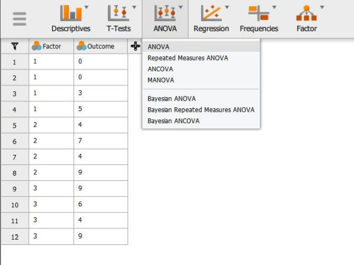
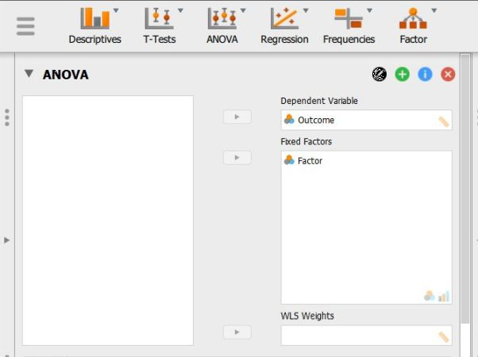
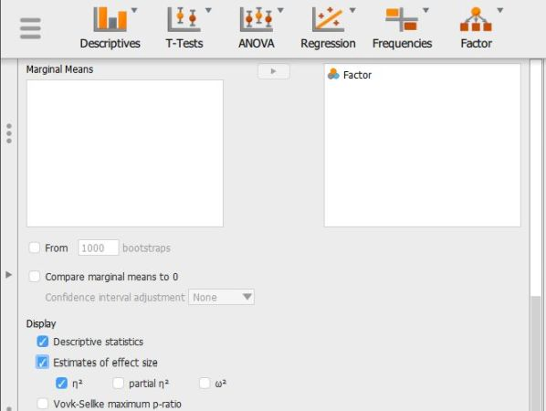

# [JASP Articles](../index.md)

## Data Analysis | OneWay ANOVA

### Selecting the Analysis

1. First, enter multiple group data (described elsewhere). 

2. In the "Analyses" section of the menu, select the "ANOVA → ANOVA" option. 

{: .image}

### Obtaining Inferential Statistics

3. A set of options will then appear for you to choose the variables and statistics of interest.

4. Select the outcome variable and click the arrow to move it into the "Dependent  Variable" box. 

5. Move the Factor (Independent Variable) to the "Fixed Factors" box.

6. Output will automatically appear on the right side of the window. 

{: .image}

### Obtaining Additional Statistics

7. Though some basic summary  statistics are displayed by default, you can make changes by expanding the "Additional Options" drop-down menu.

8. Move the factor (Independent Variable) name from the left-hand box for "Marginal means" to the right-hand box. 

9. Select options that are important for you: "Estimates of effect size"  will display the chosen statistics; and "Descriptive statistics" will offer means and standard deviations for each group.

10. Updated output will automatically appear on the right side of the window. 

{: .image}

