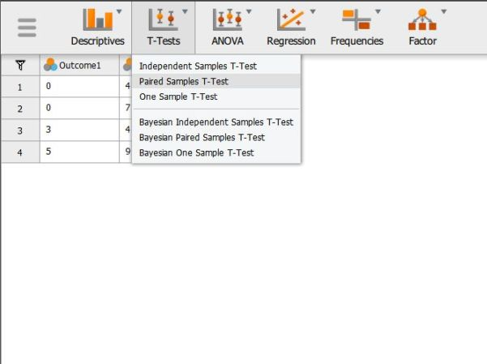
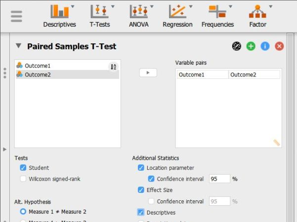
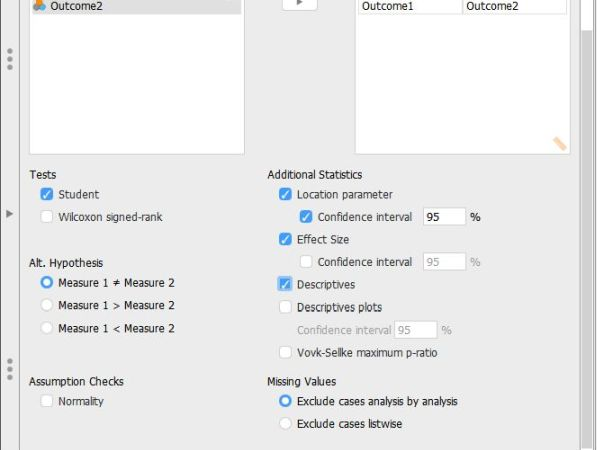

# [JASP Articles](../index.md)

## Data Analysis | Paired Samples t Test

### Selecting the Analysis

1. First, load the paired samples or repeated measures data file that you previously created (described elsewhere). Be sure that the data file looks as you intended. 

2. Select the "T-Tests → Paired Samples T-Test" option. 

<kbd></kbd>

### Obtaining Inferential Statistics

3. A set of options will then appear for you to choose the variables and statistics of interest.

4. Select the variables you wish to analyze by clicking on both of them while holding down the "CTRL" key. Then click on the arrow to move the pair of variables to the right-hand box.

5. Output will automatically appear on the right side of the window. Output can be copied and pasted into other software for printing.

<kbd></kbd>

### Obtaining Additional Statistics

6. Select the options that are important for you: "Location parameter" will display the size of the difference between the two means; "Effect size" will display Cohen's d; and "Descriptives" will offer means and standard deviations for each variable.

7. If you wish to view (and alter) the widths of the confidence intervals, check the "Confidence Interval" boxes. 

8. Updated output will automatically appear on the right side of the window. Output can be copied and pasted into other software for printing.

<kbd></kbd>

