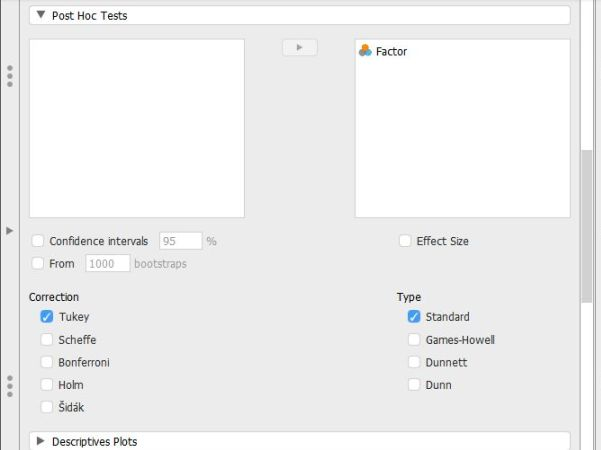

# [JASP Articles](../index.md)

## Data Analysis | Post Hoc Comparisons

### Selecting the Analysis

1. First, enter multiple group data (described elsewhere).

2. In the "Analyses" section of the menu, select the "ANOVA → ANOVA" option. 

{: .image}

### Obtaining Inferential Statistics

3. A set of options will then appear for you to choose the variables and statistics of interest.

4. Select the outcome variable and click the arrow to move it into the "Dependent Variable" box. 

5. Move the Factor (Independent Variable) to the "Fixed Factors" box.

6. Output will automatically appear on the right side of the window. 

{: .image}

### Obtaining Additional Statistics

7. Though some basic summary statistics are displayed by default, you can make changes by expanding the "Additional Options" drop-down menu.

8. Move the factor (Independent Variable) name from the left-hand box for "Marginal means" to the right-hand box. 

9. Select options that are important for you: "Estimates of effect size" will display the chosen statistics; and "Descriptive statistics" will offer means and standard deviations for each group.

10. Updated output will automatically appear on the right side of the window. 

{: .image}

### Obtaining Post Hoc Tests

11. If you wish to obtain post hoc tests for the purpose of making comparisons between groups, click the "Post Hoc Tests" drop-down button. 

12. Move the factor (Independent Variable) name from the left-hand box to the right-hand box.

13. Select "Tukey" to get Tukey HSD post hoc tests (or  whatever option you prefer). 

14. Updated output will automatically appear on the right side of the window.

{: .image}

