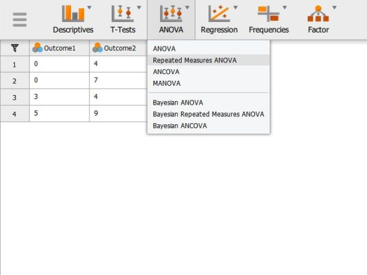

# [JASP Articles](../index.md)

## Data Analysis | Repeated Measures ANOVA 

### Selecting the Analysis

1. First, enter repeated measures data (described elsewhere).

2. In the "Analyses" section of the menu, select the "ANOVA → Repeated Measures ANOVA" option.

{: .screenshot}

### Labeling the Within-Subjects Variable/Factor

3. A set of options will then appear for you to choose the variables and statistics of interest.

4. In the "Repeated Measures Factors" box, you will define the repeated measures factor. This box is necessary for labeling the repeated measurements of the same underlying factor.

5. Click on "RM Factor 1" and type in the name you wish to give to the repeated measures factor. In this example, the measurements/columns reflect quizzes at two different times so "Time" is used as the name.

6. Below that, click on "Level 1" to type the name of the individual level of the repeated measures factor. You may do the same for each level. In this example, the quiz was given twice, so  there were only 2 levels of the factor.

{: .screenshot}

### Obtaining Inferential Statistics

7. In the "Repeated Measures Cells" box, you will indicate which measurements/columns in the data set reflect the instances of the repeated measurements.

8. Select the instances you wish to associate with the factor by clicking on them and then arrow to move them. In this example, "t1score" reflects the first level of the factor and "t2score"  reflects the second level of the factor.

9. Note that this factor only exists in the computer's memory. For examples, nowhere in the data set will you see a variable called "Time."

10. Output will automatically appear on the right side of the window. Output can be copied and pasted into other software for printing.

{: .screenshot}

### Obtaining Additional Statistics

11. Though some basic summary statistics are displayed by default, you can make changes by expanding the "Additional Options" drop-down menu.

12. Select options that are important for you: "Estimates of effect size" will display the chosen statistics; and "Descriptive statistics" will offer means and standard deviations for each group.

13. Updated output will automatically appear on the right side of the window. Output can be copied and pasted into other software for printing.

{: .screenshot}

