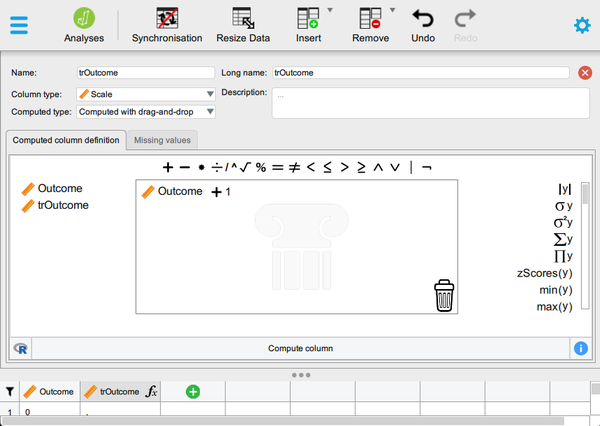
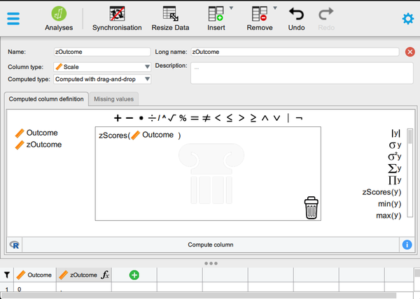
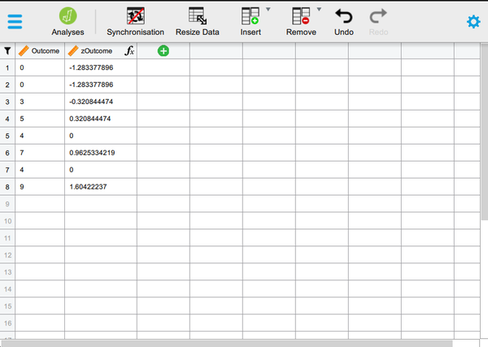

# [JASP Articles](../index.md)

## Data Analysis | Transformations and Standardized Scores

### Selecting the Analysis

1. First, enter the data (described elsewhere).

2. In the “Edit Data” section of the menu, click on the green “+” sign in the last column. A new box will pop up for you to define the variable.

{: .image}

### Computing Transformations

3. Type in the new you wish to give the new variable (here it is “trOutcome"). Hit “Enter” to be sure the rest of the cells populate.

4. For “Computed Type”, be sure to select “Computed with Drag and Drop”. 

5. In the tab labeled “Computed Column Definition”, drag your original variable (here “Outcome”) to the main box. Click on the math operator (here “+”) and then click on the dots (and type your number).

6. Click on “Compute Column” to finalize the data transformation. 

7. To hide the setup menu, click on the large red “X”.

{: .image}

### Viewing Transformed Scores

8. Note that transformed variables are not included in the output. Rather, they are saved as new variables in the data view window. 

9. These variables can be used in subsequent analyses. You can follow the previous tutorials to get descriptive statistics for these variables.

{: .image}

### Obtaining Standardized Scores

10.	In addition, you can obtain standardized scores. First, enter the data (described elsewhere).

11.	In the “Edit Data” section of the menu, click on the green “+” sign in the last column. A new box will pop up for you to define the variable.

{: .image}

### Computing Standardized Scores

12.	Type in the new you wish to give the new variable (here it is “zOutcome"). Hit “Enter” to be sure the rest of the cells populate.

13.	For “Computed Type”, be sure to select “Computed with Drag and Drop”. 

14.	In the tab labeled “Computed Column Definition”, click on “zScores(y)” on the right. Drag your original variable (here “Outcome”) to take the place of the “y” variable. 

15.	Click on “Compute Column” to finalize the data transformation. 

16.	To hide the setup menu, click on the large red “X”.

{: .image}

### Viewing Standardized Scores

17.	Note that standardized variables are not included in the output. Rather, they are saved as new variables in the data view window. 

18.	These variables can be used in subsequent analyses. You can follow the previous tutorials to get descriptive statistics for these variables.

{: .image}

