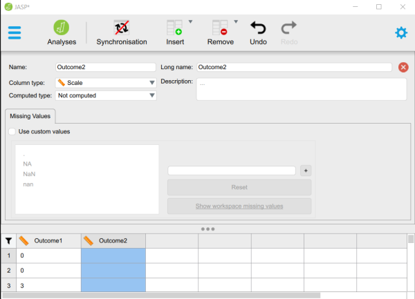
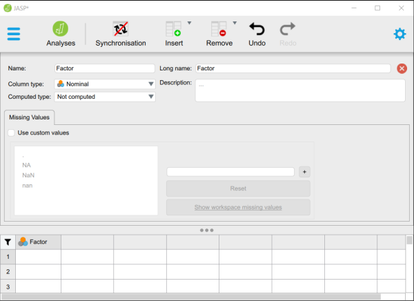

# JASP | Data Entry

## One Sample Data 

### Entering Data on One Variable (Using a Spreadsheet)

1. In the first row and first cell, type the name of the outcome variable you wish to analyze.

2. Enter the data in the individual cells of the column for the variable. Note that each cell should contain a single score for an individual person. There will be as many rows as people. 

3. When saving the file, be sure to save it as a CSV (comma delimited) file.

<kbd></kbd>

### Entering Data on One Variable (Using a Text Editor)

4. In the first row, type the name of the outcome variable you wish to analyze. 

5. Enter the data in separate rows. Note that each row should contain a single score for an individual person. There will be as many rows as people. 

6. When saving the file, be sure to save it as a CSV (comma delimited) file.

<kbd></kbd>

## Repeated Measures Data 

### Entering Data (Using a Spreadsheet)

1. For repeated measures data, the columns represent the different instances of the within-subjects variable. In the example here, each column is a measurement of the same outcome variable (with the first row labeled accordingly).

2. Notice that each participant has scores on both variables. In this example, each of the five participants has a score for Outcome1 and for Outcome2. 

3. When saving the file, be sure to save it as a CSV (comma delimited) file.

<kbd></kbd>

### Entering Data (Using a Text Editor)

4. For repeated measures data, the columns represent the different instances of the within-subjects variable. In the example here, each column is a measurement of the same outcome variable (with the first row labeled accordingly).

5. Notice that each participant has scores on both variables. In this example, each of the five  participants has a score for Outcome1 and for Outcome2. 

6. When saving the file, be sure to save it as a CSV (comma delimited) file.

<kbd></kbd>

## Multiple Sample Data 

### Entering Data (Using a Spreadsheet)

1. In the first row, type the names of the variables you wish to analyze. One variable will represent the Factor (Independent Variable) and the other will represent the Outcome (Dependent) Variable.

2. Enter the data for all of the participants. Notice that each participant has scores on both the Factor and Outcome Variables. There will be as many rows as people. 

3. On the categorical Factor, use the group number as the value for the individual.

4. If your data set has more than two groups, simply be sure to add a group indicator and a score for each additional person.

<kbd></kbd>

### Entering Data (Using a Text Editor)

5. In the first row, type the names of the variables you wish to analyze (with names separated by commas). One variable will represent the Factor (Independent Variable) and the other will represent the Outcome (Dependent) Variable.

6. Enter the data for all of the participants. Notice that each participant has scores on both the Factor and Outcome Variables (with values separated by commas). There will be as many rows as people. 

7. On the categorical Factor, use the group number as the value for the individual.

8. If your data set has more than two groups, simply be sure to add a group indicator and a score for each additional person.

<kbd></kbd>

## Factorial Data 

### Entering Data (Using a Spreadsheet)

1. In the first row, type the names of the variables you wish to analyze. You should represent the Factors (Independent Variables) and the Outcome (Dependent) Variable.

2. Enter the scores for each of the same participants on the new variables. Notice that each individual (i.e., the rows) will still have values for each variable (i.e., the columns).

3. On the categorical Factors, note that the combination of values in the Factors will define the multiple groups of the factorial design. 

4. When saving the file, be sure to save it as a CSV (comma delimited) file.

<kbd></kbd>

### Entering Data (Using a Text Editor)

5. In the first row, type the names of the variables you wish to analyze. You should represent the Factors (Independent Variables) and the Outcome (Dependent) Variable.

6. Enter the scores for each of the same participants on the new variables. Notice that each individual (i.e., the rows) will still have values for each variable (i.e., the columns).

7. On the categorical Factors, note that the combination of values in the Factors will define the multiple groups of the factorial design. 

8. When saving the file, be sure to save it as a CSV (comma delimited) file.

<kbd></kbd>

