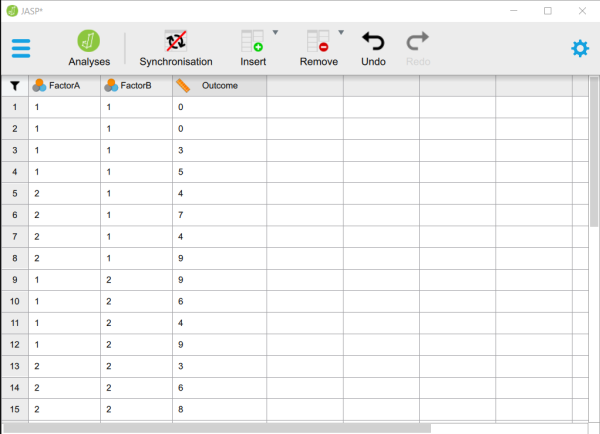

# [JASP Articles](../index.md)

## Data Entry | Factorial Data 

### Defining Variables

1. First, click on the "Edit Data" button on the top of the window. Generally speaking, this is where you will enter the data for all of the variables in the data set. 

2. Double-click on a cell column header (i.e., variable) that you wish to define. This will bring up a new set of options. 

<kbd></kbd>

### Setting Variable Properties

3. You will need to define multiple variables. Two variables will represent the Factors (Independent Variables) and the other will represent the Outcome (Dependent) Variable.

4. Provide a name and define the level of measurement for the variables by choosing the appropriate options. In this example, "FactorA" and "FactorB" nominal. The "Outcome" (Dependent) variable is continuous (Scale).

5. To close the variable menu, click on the red "x" button next to the variable name.

<kbd></kbd>

### Entering Data
 
6. Enter the data for all of the participants. Notice that each participant has scores on both of the Factors and on the Outcome Variable. There will be as many rows as people. 

7. On the categorical Factors, use the values that you indicated when defining the variables earlier. Note that the combination of values in the Factors will define the multiple groups of the factorial design.

8. If your data set has more than two levels for either (or both) of the Factors, simply be sure to add an indicator and an outcome value for each additional person.

9. When done, click on the "Analyses" button on the top of the window.

<kbd></kbd>

