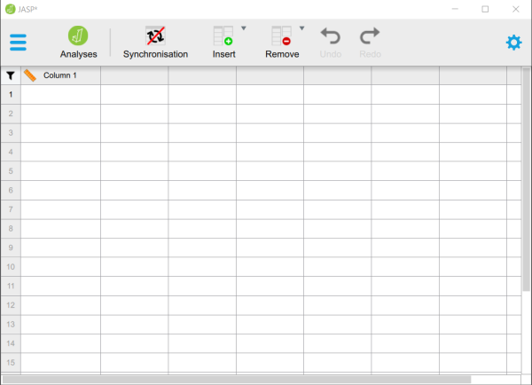

# JASP | Data Entry

## Factorial Data 

### Entering Data (Using a Spreadsheet)

1. In the first row, type the names of the variables you wish to analyze. You should represent the Factors (Independent Variables) and the Outcome (Dependent) Variable.

2. Enter the scores for each of the same participants on the new variables. Notice that each individual (i.e., the rows) will still have values for each variable (i.e., the columns).

3. On the categorical Factors, note that the combination of values in the Factors will define the multiple groups of the factorial design. 

4. When saving the file, be sure to save it as a CSV (comma delimited) file.

<kbd></kbd>

### Entering Data (Using a Text Editor)

5. In the first row, type the names of the variables you wish to analyze. You should represent the Factors (Independent Variables) and the Outcome (Dependent) Variable.

6. Enter the scores for each of the same participants on the new variables. Notice that each individual (i.e., the rows) will still have values for each variable (i.e., the columns).

7. On the categorical Factors, note that the combination of values in the Factors will define the multiple groups of the factorial design. 

8. When saving the file, be sure to save it as a CSV (comma delimited) file.

<kbd></kbd>

