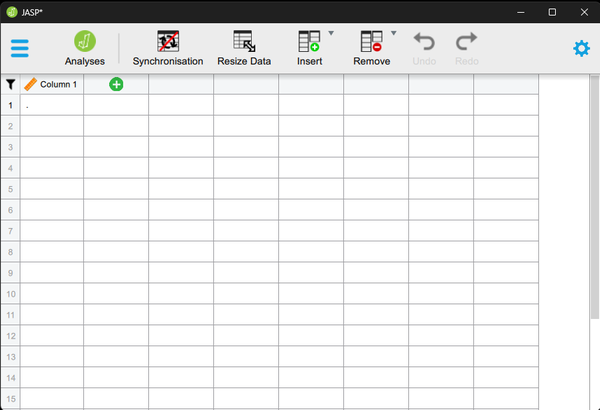
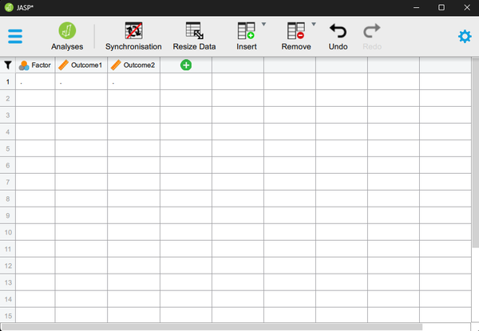
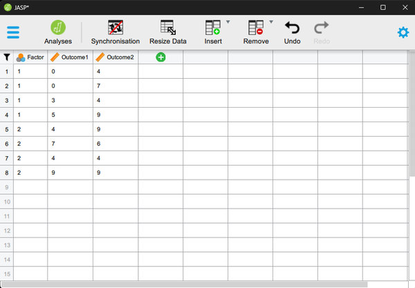

# [JASP Articles](../index.md)

## Data Entry | Mixed Data 

### Defining Variables

1. First, click on the "Edit Data" button on the top of the window. Generally speaking, this is where you will enter the data for all of the variables in the data set. 

2. Double-click on a cell column header (i.e., variable) that you wish to define. This will bring up a new set of options. 

{: .screenshot}

### Setting Variable Properties

3.	You will need to define multiple variables. One variable will represent the Factor (Independent Variable) and the other will represent the within-subjects instances of the Outcome (Dependent) variable.

4.	Provide a name and define the level of measurement for the variables by choosing the appropriate options. In this example, “Factor” (Independent Variable) is nominal. The various “Outcome” (Dependent) variables are continuous.

5.	To hide the setup menu, click on the large UP arrow button next to the variable name.

{: .screenshot}

### Entering Data
 
6.	Enter the data for all of the participants. Notice that each participant has scores on the Factor and on both instances of the Outcome Variable. There will be as many rows as people.

7.	On the categorical “Factor”, use the values that you indicated when defining the variables earlier.

8.	If your data set has more than two levels of the Factor, simply be sure to add an indicator and the outcome values for each additional person.

9. When done, click on the "Analyses" button on the top of the window.

{: .screenshot}

