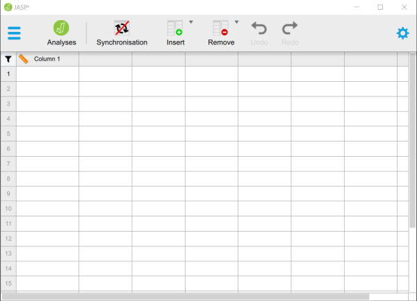
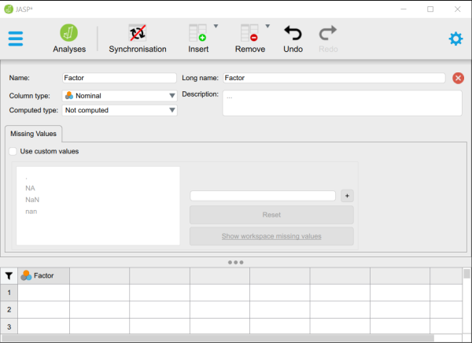
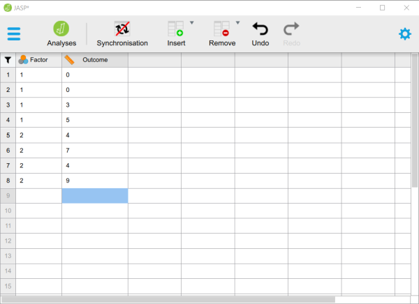

# [JASP Articles](../index.md)

## Data Entry | Two and Multiple Sample Data 

### Defining Variables

1. First, click on the "Edit Data" button on the top of the window. Generally speaking, this is where you will enter the data for all of the variables in the data set. 

2. Double-click on a cell column header (i.e., variable) that you wish to define. This will bring up a new set of options.  

{: .screenshot}

### Setting Variable Properties

3. You will need to define multiple variables. One variable will represent the Factor (Independent Variable) and the other will represent the Outcome (Dependent) Variable.

4. Provide a name and define the level of measurement for the variables by choosing the appropriate options. In this example, "Factor" (Independent Variable) is nominal. The "Outcome" (Dependent) variable is continuous (Scale).

5. To close the variable menu, click on the red "x" button next to the variable name.

{: .screenshot}

### Entering Data

6. Enter the data for all of the participants. Notice that each participant has scores on both the Factor and Outcome Variables. There will be as many rows as people.

7. On the categorical "Factor", you will use numbers to represent the two categories (or "levels") of the variable.

8. If your data set has more than two groups, simply be sure to add a group indicator (a value on the "Factor" variable) and a "Outcome" for each additional person. 

9. When done, click on the "Analyses" button on the top of the window.

{: .screenshot}

