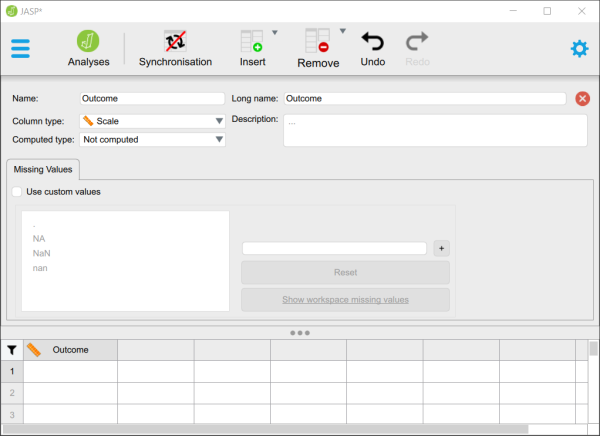

# JASP | Data Entry

## One Sample Data

### Defining Variables

1. First, click on the "Edit Data" button on the top of the window. Generally speaking, this is where you will enter the data for all of the variables in the data set. 

2. Double-click on a cell column header (i.e., variable) that you wish to define. This will bring up a new set of options. 

<kbd></kbd>

### Setting Variable Properties

3. Type in the name of the variable in the top box (previously labeled "A").

4. Define the level of measurement for the variables by choosing the appropriate option. In this example, "Outcome" (an outcome variable) is continuous (Scale).

5. To close the variable menu, click on the red "x" button to the right of the variable name.

<kbd></kbd>

### Entering Data

6. Enter the data in the individual cells of the column for the variable. Note that each cell should contain a single score for an individual person. There will be as many rows as people. 

7. When done, click on the "Analyses" button on the top of the window.

<kbd></kbd>

