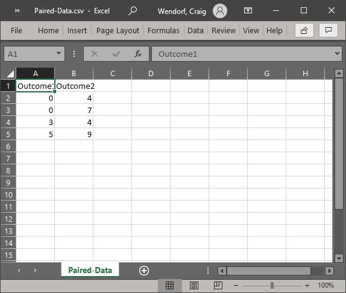
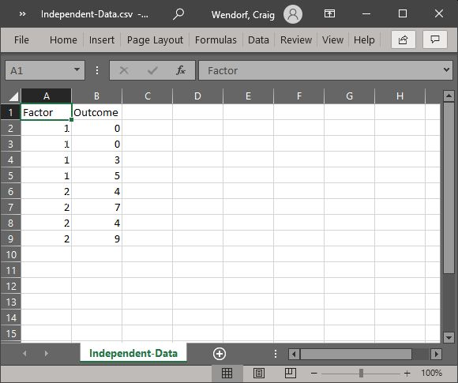
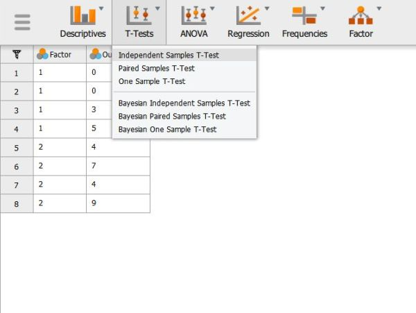
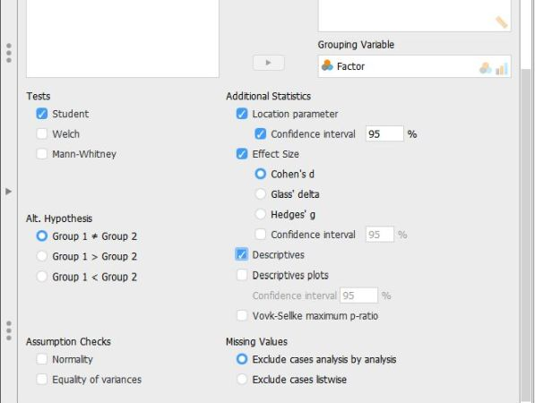
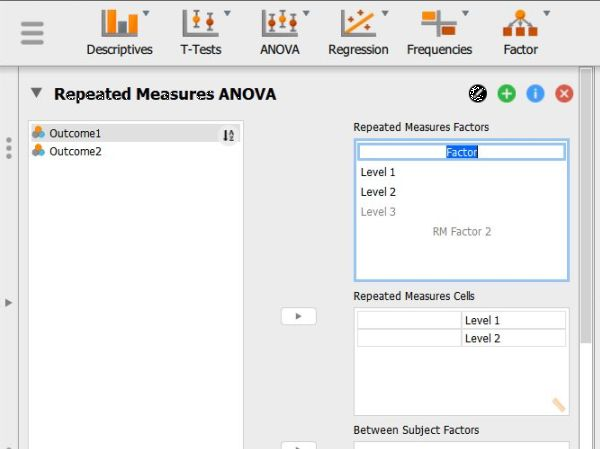

## JASP: Using the Software

This chapter provides step-by-step instructions on how to obtain basic statistical output using JASP, both visually with screenshots and via written instructions. Simple examples for most undergraduate-level between-subjects and within-subjects research designs are provided.

- [Entering One Sample Data](#entering-one-sample-data)
- [Entering Repeated Measures Data](#entering-repeated-measures-data)
- [Entering Multiple Sample Data](#entering-multiple-sample-data)
- [Entering Factorial Data](#entering-factorial-data)
- [Descriptives (Frequencies and Descriptive Statistics)](#descriptives-frequencies-and-descriptive-statistics)
- [Correlations (Bivariate)](#correlations-bivariate)
- [T Test (Confidence Intervals)](#t-test-confidence-intervals)
- [T Test (One Sample)](#t-test-one-sample)
- [T Test (Paired Samples)](#t-test-paired-samples)
- [T Test (Independent Samples)](#t-test-independent-samples)
- [ANOVA (OneWay ANOVA)](#anova-oneway-anova)
- [Repeated Measures ANOVA](#repeated-measures-anova)
- [ANOVA (Factorial ANOVA)](#anova-factorial-anova)

---

### Entering One Sample Data 

#### Steps for Entering Data on One Variable (Using a Spreadsheet)

1. In the first row and first 
cell, type the name of the 
outcome variable you wish
to analyze.

2. Enter the data in the
individual cells of the
column for the variable. 
Note that each cell should 
contain a single score for 
an individual person.
There will be as many rows 
as people. 

3. When saving the file, be 
sure to save it as a CSV 
(comma delimited) file.

<kbd></kbd>

#### Steps for Entering Data on One Variable (Using a Text Editor)

4. In the first row, type the 
 name of the outcome variable 
 you wish to analyze. 

5. Enter the data in separate 
 rows. Note that each row 
 should contain a single
 score for an individual
 person. There will be as 
 many rows as people. 

6. When saving the file, be 
 sure to save it as a CSV 
 (comma delimited) file.

<kbd></kbd>

---

### Entering Repeated Measures Data 

#### Steps for Entering Data (Using a Spreadsheet)

1. For repeated measures data,
 the columns represent the
 different instances of the 
 within-subjects variable. In 
 the example here, each 
 column is a measurement of 
 the same outcome variable
 (with the first row labeled
 accordingly).

2. Notice that each participant 
 has scores on both 
 variables. In this example,
 each of the five 
 participants has a score for 
 Outcome1 and for Outcome2. 

3. When saving the file, be 
 sure to save it as a CSV 
 (comma delimited) file.

<kbd></kbd>

#### Steps for Entering Data (Using a Text Editor)

4. For repeated measures data,
 the columns represent the
 different instances of the 
 within-subjects variable. In 
 the example here, each 
 column is a measurement of 
 the same outcome variable
 (with the first row labeled
 accordingly).

5. Notice that each participant 
 has scores on both 
 variables. In this example,
 each of the five 
 participants has a score for 
 Outcome1 and for Outcome2. 

6. When saving the file, be 
 sure to save it as a CSV 
 (comma delimited) file.

<kbd></kbd>

---

### Entering Multiple Sample Data 

#### Steps for Entering Data (Using a Spreadsheet)

1. In the first row, type the 
names of the variables you 
wish to analyze. One 
variable will represent
the Factor (Independent
Variable) and the other
will represent the Outcome 
(Dependent) Variable.

2. Enter the data for all of
the participants. Notice 
that each participant has
scores on both the Factor
and Outcome Variables. 
There will be as many rows 
as people. 

3. On the categorical Factor, 
use the group number as
the value for the
individual.

4. If your data set has more
than two groups, simply be 
sure to add a group
indicator and a score for
each additional person.

<kbd></kbd>

#### Steps for Entering Data (Using a Text Editor)

5. In the first row, type the 
 names of the variables you 
 wish to analyze (with names
 separated by commas). One
 variable will represent the
 Factor (Independent
 Variable) and the other will 
 represent the Outcome
 (Dependent) Variable.

6. Enter the data for all of
 the participants. Notice 
 that each participant has
 scores on both the Factor
 and Outcome Variables (with
 values separated by commas). 
 There will be as many rows 
 as people. 

7. On the categorical Factor, 
 use the group number as the
 value for the individual.

8. If your data set has more
 than two groups, simply be 
 sure to add a group
 indicator and a score for
 each additional person.

<kbd></kbd>

---

### Entering Factorial Data 

#### Steps for Entering Data (Using a Spreadsheet)

1. In the first row, type the 
 names of the variables you 
 wish to analyze. You should
 represent the Factors
 (Independent Variables) and
 the Outcome (Dependent)
 Variable.

2. Enter the scores for each of 
 the same participants on the 
 new variables. Notice that 
 each individual (i.e., the 
 rows) will still have values 
 for each variable (i.e., the 
 columns).

3. On the categorical Factors,
 note that the combination of 
 values in the Factors will 
 define the multiple groups 
 of the factorial design. 

4. When saving the file, be 
 sure to save it as a CSV 
 (comma delimited) file.

<kbd></kbd>

#### Steps for Entering Data (Using a Text Editor)

5. In the first row, type the 
 names of the variables you 
 wish to analyze. You should
 represent the Factors
 (Independent Variables) and
 the Outcome (Dependent)
 Variable.

6. Enter the scores for each of 
 the same participants on the 
 new variables. Notice that 
 each individual (i.e., the 
 rows) will still have values 
 for each variable (i.e., the 
 columns).

7. On the categorical Factors,
 note that the combination of 
 values in the Factors will 
 define the multiple groups 
 of the factorial design. 

8. When saving the file, be 
 sure to save it as a CSV 
 (comma delimited) file.

<kbd></kbd>

---

### Descriptives (Frequencies and Descriptive Statistics) 

#### Steps for Obtaining Frequency-Related Statistics

1. First, load the data file
previously created 
(described elsewhere). Be
sure that the data file
looks as you intended. 

2. Select the
"Descriptives →
Descriptive Statistics"
option.

<kbd></kbd>

#### Steps for Obtaining a Frequency Distribution

3. A set of options will then 
appear for you to choose 
the variables and
statistics of interest.

4. Select the variables you 
wish to analyze by 
clicking on them in the
left-hand box and then the 
arrow to move them into
the right-hand box.

5. Be sure that "Display
frequency tables" is 
checked. Without this
checked, you will not get
a frequency distribution.

6. Output will automatically
appear on the right side 
of the window. 

<kbd></kbd>

#### Steps for Obtaining Summary Statistics

7. Though some basic summary statistics are displayed
by default, you can make 
changes by expanding the 
"Statistics" drop-down 
menu.

8. As you select the desired
statistics, the output on
the right side of the
window will be 
automatically updated. 

9. Individual tables (or even 
the whole section of 
Output) can be copied
using the drop-down arrow
options in the output. 
These can be pasted into 
other word processing
software for printing
purposes.

<kbd></kbd>

---

### Correlations (Bivariate) 

#### Steps for Obtaining Correlational Statistics

1. First, load the data file
 containing multiple
 variables that you 
 previously created 
 (described elsewhere). Be
 sure that the data file
 looks as you intended. 

2. Select the "Regression → 
 Correlation Matrix" option.

<kbd></kbd>

#### Steps for Obtaining the Correlations (and Significance Tests)

3. A set of options will then 
 appear for you to choose the 
 variables and statistics of
 interest.

4. Select the variables you 
 wish to analyze by clicking
 on them in the left-hand box 
 and then the arrow to move 
 them into the right-hand 
 box. 

5. Output (with no descriptive
 statistics) will 
 automatically appear on the
 right side of the window.
 Output can be copied and 
 pasted into other documents
 for printing.

6. If you wish descriptive
 statistics associated with 
 each variable, follow the
 "Descriptives" procedures
 described earlier in this
 manual.

<kbd></kbd>

---

### T Test (Confidence Intervals) 

#### Steps for Obtaining One-Sample Inferential Statistics

1. First, load the data file
that you previously
created (described 
elsewhere). Be sure that 
the data file looks as you 
intended.

2. Select the "T-Tests → One
Sample T-Test" option.

<kbd></kbd>

#### Steps for Choosing the Variable

3. A set of options will then 
appear for you to choose 
the variables and
statistics of interest.

4. Select the variable you wish 
to analyze by clicking on
it in the left-hand box
and then the arrow to move 
it into the right-hand 
box. 

5. Output will automatically
appear on the right side 
of the window. Output can
be copied and pasted into
other documents for
printing.

<kbd></kbd>

#### Steps for Obtaining the Statistics

6. To get the confidence interval for the mean, make sure the “Test Value” is set to zero.

7. Check the “Confidence Interval” box (and alter the width of the interval if desired). 

8. Similarly, select other options that are important for you: “Descriptives” will offer a mean and standard deviation for the variable; and “Descriptives plots” will provide a graph of the confidence interval.

9. Updated output will automatically appear on the right side of the window. Output can be copied and pasted into other documents for printing.

<kbd></kbd>

---

### T Test (One Sample) 

#### Steps for Obtaining One-Sample Inferential Statistics

1. First, load the data file
that you previously
created (described 
elsewhere). Be sure that 
the data file looks as you 
intended.

2. Select the "T-Tests → One
Sample T-Test" option.

<kbd></kbd>

#### Steps for Obtaining the Significance Test

3. A set of options will then 
appear for you to choose 
the variables and
statistics of interest.

4. Select the variable you wish 
to analyze by clicking on
it in the left-hand box
and then the arrow to move 
it into the right-hand 
box. 

5. Be sure to enter a known or
hypothesized mean into the 
"Test Value" field. If you 
do not enter a value here, 
JASP will automatically
use zero as the comparison 
mean.

6. Output will automatically
appear on the right side 
of the window. Output can
be copied and pasted into
other documents for
printing.

<kbd></kbd>

#### Steps for Obtaining Additional Statistics

7. Select the options that are
important for you: 
"Location parameter" will
display the size of the
difference between the two 
means; "Effect size" will
display Cohen's d; and 
"Descriptives" will offer
a mean and standard
deviation for the group. 

8. If you wish to view (and 
alter) the widths of the 
confidence intervals,
check the relevant 
"Confidence Interval"
boxes. 

9. Updated output will
automatically appear on
the right side of the
window. Output can be
copied and pasted into 
other documents for
printing.

<kbd></kbd>

---

### T Test (Paired Samples) 

#### Steps for Obtaining Paired-Sample Inferential Statistics

1. First, load the paired 
samples or repeated
measures data file that
you previously created 
(described elsewhere). Be
sure that the data file
looks as you intended. 

2. Select the "T-Tests → Paired 
Samples T-Test" option. 

<kbd></kbd>

#### Steps for Obtaining the Significance Test

3. A set of options will then 
appear for you to choose 
the variables and
statistics of interest.

4. Select the variables you 
wish to analyze by 
clicking on both of them 
while holding down the 
"CTRL" key. Then click on
the arrow to move the pair 
of variables to the
right-hand box.

5. Output will automatically
appear on the right side 
of the window. Output can
be copied and pasted into
other documents for
printing.

<kbd></kbd>

#### Steps for Obtaining Additional Statistics

6. Select the options that are
important for you: 
"Location parameter" will
display the size of the
difference between the two 
means; "Effect size" will
display Cohen's d; and 
"Descriptives" will offer
means and standard 
deviations for each
variable.

7. If you wish to view (and 
alter) the widths of the 
confidence intervals,
check the "Confidence
Interval" boxes. 

8. Updated output will
automatically appear on
the right side of the
window. Output can be
copied and pasted into 
other documents for
printing.

<kbd></kbd>

---

### T Test (Independent Samples) 

#### Steps for Obtaining Two-Sample Inferential Statistics

1. First, load the two sample 
 data file that you 
 previously created 
 (described elsewhere). Be
 sure that the data file
 looks as you intended. 

2. Select the "T-Tests →
 Independent Samples T-Test"
 option. 

<kbd></kbd>

#### Steps for Obtaining the Significance Test

3. A set of options will then 
 appear for you to choose the 
 variables and statistics of
 interest.

4. Select the outcome variable
 and click the arrow to move
 it into the "Dependent 
 Variables" box.

5. Move the Independent 
 Variable to the "Grouping
 Variable" box. 

6. Output will automatically
 appear on the right side of
 the window. Output can be
 copied and pasted into other 
 documents for printing.

<kbd></kbd>

#### Steps for Obtaining Additional Statistics

7. Select the options that are
 important for you: "Location 
 parameter" will display the
 size of the difference 
 between the two group's
 means; "Effect size" will
 display Cohen's d; and 
 "Descriptives" will offer
 means and standard 
 deviations for each group. 

8. If you wish to view (and 
 alter) the widths of the 
 confidence intervals, check
 the "Confidence Interval"
 boxes. 

9. Updated output will
 automatically appear on the
 right side of the window.
 Output can be copied and 
 pasted into other documents
 for printing.

<kbd></kbd>

---

### ANOVA (OneWay ANOVA) 

#### Steps for Obtaining Multiple-Sample Inferential Statistics

1. First, load the two sample 
 data file that you 
 previously created 
 (described elsewhere). Be
 sure that the data file
 looks as you intended. 

2. Select the "ANOVA → ANOVA" 
 option. 

<kbd></kbd>

#### Steps for Obtaining the Significance Test

3. A set of options will then 
 appear for you to choose the 
 variables and statistics of
 interest.

4. Select the outcome variable
 and click the arrow to move
 it into the "Dependent 
 Variable" box. 

5. Move the Factor (Independent 
 Variable) to the "Fixed
 Factors" box.

6. Output will automatically
 appear on the right side of
 the window. Output can be
 copied and pasted into other 
 documents for printing.

<kbd></kbd>

#### Steps for Obtaining Additional Statistics

7. Though some basic summary
 statistics are displayed by
 default, you can make
 changes by expanding the 
 "Additional Options" 
 drop-down menu.

8. Move the factor (Independent 
 Variable) name from the
 left-hand box for "Marginal
 means" to the right-hand 
 box. 

9. Select options that are
 important for you: 
 "Estimates of effect size" 
 will display the chosen
 statistics; and "Descriptive 
 statistics" will offer means 
 and standard deviations for
 each group.

10. Updated output will
 automatically appear on the
 right side of the window.
 Output can be copied and 
 pasted into other documents
 for printing.

<kbd></kbd>

#### Steps for Obtaining Post Hoc Tests

11. If you wish to obtain post 
 hoc tests for the purpose of 
 making comparisons between 
 groups, click the "Post Hoc
 Tests" drop-down button. 

12. Move the factor (Independent 
 Variable) name from the
 left-hand box to the 
 right-hand box.

13. Select "Tukey" to get Tukey
 HSD post hoc tests (or 
 whatever option you prefer). 

14. Updated output will
 automatically appear on the
 right side of the window.
 Output can be copied and 
 pasted into other documents
 for printing.

<kbd></kbd>

---

### Repeated Measures ANOVA 

#### Steps for Obtaining Repeated Measures Inferential Statistics

1. First, load the repeated 
 measures data file that you
 previously created 
 (described elsewhere). Be
 sure that the data file
 looks as you intended. 

2. Select the "ANOVA → Repeated 
 Measures ANOVA" option.

<kbd></kbd>

#### Steps for Labeling the Within-Subjects Variable/Factor

3. A set of options will then 
 appear for you to choose the 
 variables and statistics of
 interest.

4. In the "Repeated Measures
 Factors" box, you will 
 define the repeated measures 
 factor. This box is
 necessary for labeling the 
 repeated measurements of the 
 same underlying factor.

5. Click on "RM Factor 1" and 
 type in the name you wish to 
 give to the repeated 
 measures factor. In this 
 example, the 
 measurements/columns reflect 
 quizzes at two different 
 times so "Time" is used as 
 the name.

6. Below that, click on "Level
 1" to type the name of the 
 individual level of the
 repeated measures factor.
 You may do the same for each 
 level. In this example, the
 quiz was given twice, so 
 there were only 2 levels of
 the factor.

<kbd></kbd>

#### Steps for Obtaining the Significance Test

7. In the "Repeated Measures
 Cells" box, you will 
 indicate which 
 measurements/columns in the
 data set reflect the 
 instances of the repeated
 measurements.

8. Select the instances you 
 wish to associate with the 
 factor by clicking on them 
 and then arrow to move them. 
 In this example, "t1score" 
 reflects the first level of
 the factor and "t2score" 
 reflects the second level of 
 the factor.

9. Note that this factor only 
 exists in the computer's 
 memory. For examples,
 nowhere in the data set will 
 you see a variable called
 "Time."

10. Output will automatically
 appear on the right side of
 the window. Output can be
 copied and pasted into other 
 documents for printing.

<kbd></kbd>

#### Steps for Obtaining Additional Statistics

11. Though some basic summary
 statistics are displayed by
 default, you can make
 changes by expanding the 
 "Additional Options" 
 drop-down menu.

12. Select options that are
 important for you: 
 "Estimates of effect size" 
 will display the chosen
 statistics; and "Descriptive 
 statistics" will offer means 
 and standard deviations for
 each group.

13. Updated output will
 automatically appear on the
 right side of the window.
 Output can be copied and 
 pasted into other documents
 for printing.

<kbd></kbd>

---

### ANOVA (Factorial ANOVA) 

#### Steps for Obtaining Factorial Inferential Statistics

1. First, load the factorial
 data file that you 
 previously created 
 (described elsewhere). Be
 sure that the data file
 looks as you intended. 

2. Select the "ANOVA → ANOVA" 
 option. 

<kbd></kbd>

#### Steps for Obtaining the Significance Test

3. A set of options will then 
 appear for you to choose the 
 variables and statistics of
 interest.

4. Select the outcome variable
 and click the arrow to move
 it into the "Dependent 
 Variable" box. 

5. Move the multiple Factors
 (Independent Variables) to 
 the "Fixed Factors" box. 
 (The interaction term will 
 be automatically generated 
 in the output.)

6. Output will automatically
 appear on the right side of
 the window. Output can be
 copied and pasted into other 
 documents for printing.

<kbd></kbd>

#### Steps for Obtaining Additional Statistics

7. Though some basic summary
 statistics are displayed by
 default, you can make
 changes by expanding the 
 "Additional Options" 
 drop-down menu.

8. Move the factors 
 (Independent Variable) name
 from the left-hand box for 
 "Marginal means" to the
 right-hand box. (If you wish 
 cell means for the factorial 
 design, be sure to move the
 interaction term as well.) 

9. Select options that are
 important for you: 
 "Estimates of effect size" 
 will display the chosen
 statistics; and "Descriptive 
 statistics" will offer means 
 and standard deviations for
 each group.

10. Updated output will
 automatically appear on the
 right side of the window.
 Output can be copied and 
 pasted into other documents
 for printing.

<kbd></kbd>

