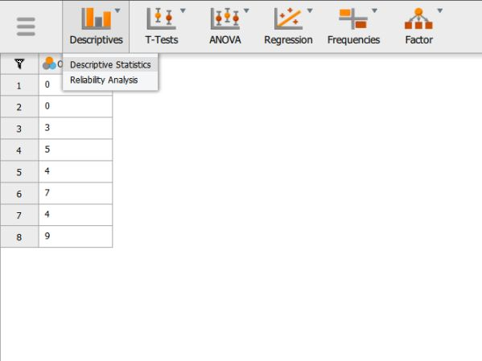
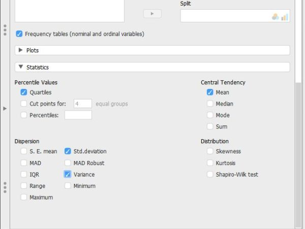

## JASP: Using the Software

### Descriptives (Frequencies and Descriptive Statistics) 

#### Steps for Obtaining Frequency-Related Statistics

1. First, load the data file
previously created 
(described elsewhere). Be
sure that the data file
looks as you intended. 

2. Select the
"Descriptives →
Descriptive Statistics"
option.

<kbd></kbd>

#### Steps for Obtaining a Frequency Distribution

3. A set of options will then 
appear for you to choose 
the variables and
statistics of interest.

4. Select the variables you 
wish to analyze by 
clicking on them in the
left-hand box and then the 
arrow to move them into
the right-hand box.

5. Be sure that "Display
frequency tables" is 
checked. Without this
checked, you will not get
a frequency distribution.

6. Output will automatically
appear on the right side 
of the window. 

<kbd></kbd>

#### Steps for Obtaining Summary Statistics

7. Though some basic summary statistics are displayed
by default, you can make 
changes by expanding the 
"Statistics" drop-down 
menu.

8. As you select the desired
statistics, the output on
the right side of the
window will be 
automatically updated. 

9. Individual tables (or even 
the whole section of 
Output) can be copied
using the drop-down arrow
options in the output. 
These can be pasted into 
other word processing
software for printing
purposes.

<kbd></kbd>

