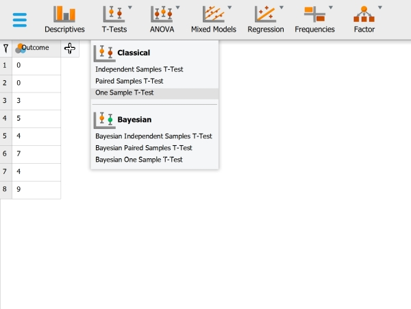
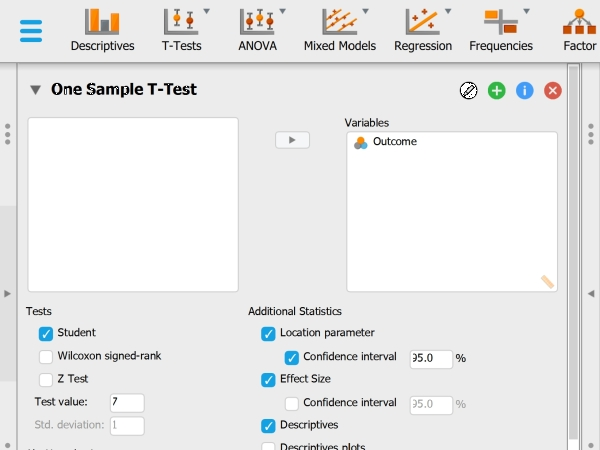
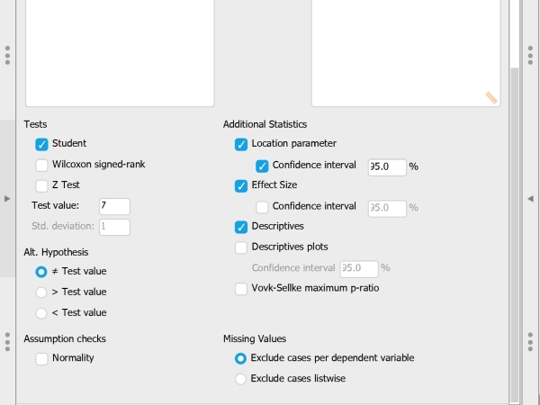

## JASP: Using the Software

### T Test (One Sample) 

#### Steps for Obtaining One-Sample Inferential Statistics

1. First, load the data file
that you previously
created (described 
elsewhere). Be sure that 
the data file looks as you 
intended.

2. Select the "T-Tests → One
Sample T-Test" option.

<kbd></kbd>

#### Steps for Obtaining the Significance Test

3. A set of options will then 
appear for you to choose 
the variables and
statistics of interest.

4. Select the variable you wish 
to analyze by clicking on
it in the left-hand box
and then the arrow to move 
it into the right-hand 
box. 

5. Be sure to enter a known or
hypothesized mean into the 
"Test Value" field. If you 
do not enter a value here, 
JASP will automatically
use zero as the comparison 
mean.

6. Output will automatically
appear on the right side 
of the window. Output can
be copied and pasted into
other documents for
printing.

<kbd></kbd>

#### Steps for Obtaining Additional Statistics

7. Select the options that are
important for you: 
"Location parameter" will
display the size of the
difference between the two 
means; "Effect size" will
display Cohen's d; and 
"Descriptives" will offer
a mean and standard
deviation for the group. 

8. If you wish to view (and 
alter) the widths of the 
confidence intervals,
check the relevant 
"Confidence Interval"
boxes. 

9. Updated output will
automatically appear on
the right side of the
window. Output can be
copied and pasted into 
other documents for
printing.

<kbd></kbd>

