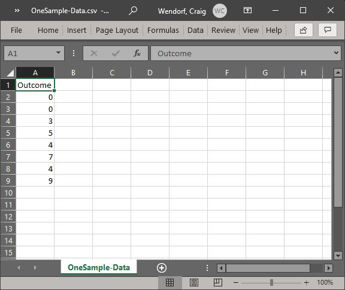
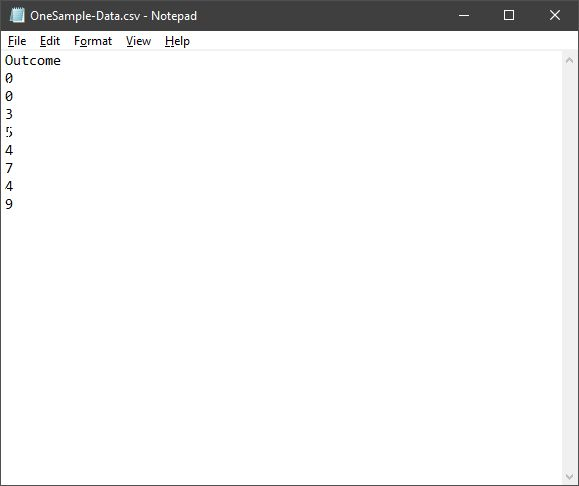

## JASP: Using the Software

### One Sample Data 

#### Entering Data on One Variable (Using a Spreadsheet)

1. In the first row and first 
cell, type the name of the 
outcome variable you wish
to analyze.

2. Enter the data in the
individual cells of the
column for the variable. 
Note that each cell should 
contain a single score for 
an individual person.
There will be as many rows 
as people. 

3. When saving the file, be 
sure to save it as a CSV 
(comma delimited) file.

<kbd></kbd>

#### Entering Data on One Variable (Using a Text Editor)

4. In the first row, type the 
 name of the outcome variable 
 you wish to analyze. 

5. Enter the data in separate 
 rows. Note that each row 
 should contain a single
 score for an individual
 person. There will be as 
 many rows as people. 

6. When saving the file, be 
 sure to save it as a CSV 
 (comma delimited) file.

<kbd></kbd>

