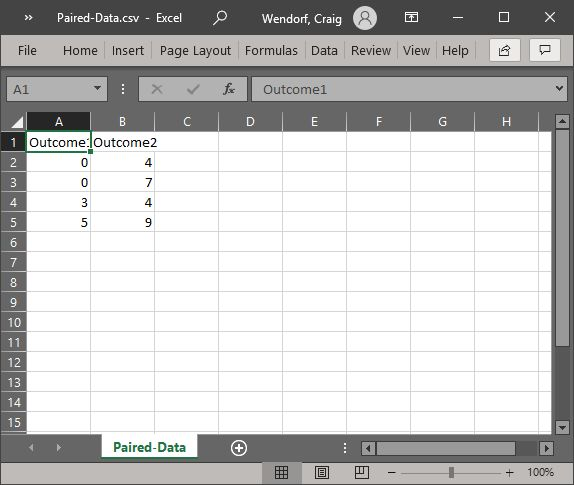
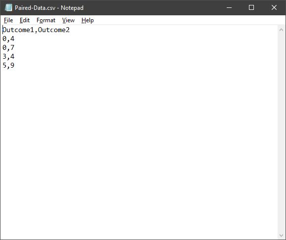

## JASP: Using the Software

### Entering Repeated Measures Data 

#### Steps for Entering Data (Using a Spreadsheet)

1. For repeated measures data,
 the columns represent the
 different instances of the 
 within-subjects variable. In 
 the example here, each 
 column is a measurement of 
 the same outcome variable
 (with the first row labeled
 accordingly).

2. Notice that each participant 
 has scores on both 
 variables. In this example,
 each of the five 
 participants has a score for 
 Outcome1 and for Outcome2. 

3. When saving the file, be 
 sure to save it as a CSV 
 (comma delimited) file.

<kbd></kbd>

#### Steps for Entering Data (Using a Text Editor)

4. For repeated measures data,
 the columns represent the
 different instances of the 
 within-subjects variable. In 
 the example here, each 
 column is a measurement of 
 the same outcome variable
 (with the first row labeled
 accordingly).

5. Notice that each participant 
 has scores on both 
 variables. In this example,
 each of the five 
 participants has a score for 
 Outcome1 and for Outcome2. 

6. When saving the file, be 
 sure to save it as a CSV 
 (comma delimited) file.

<kbd></kbd>

