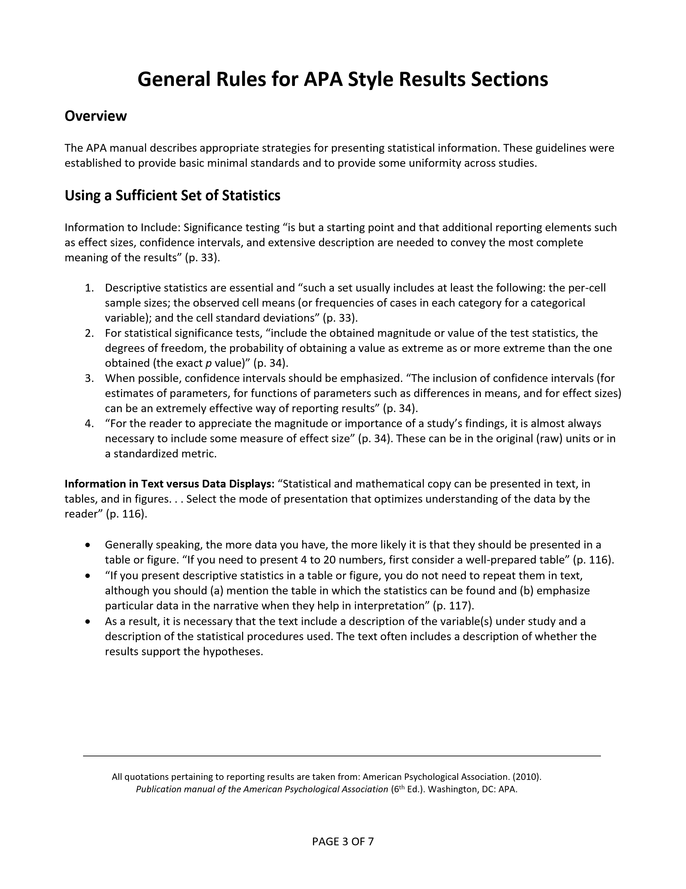

# Statistics for Social Science

### Statistical Methods: Reporting Statistics

---

**Abstract:** This chapter describes basic rules for presenting statistical results in APA style. All rules come from the newest APA style manual. Specific examples of mini Results summaries are provided, using the analyses elsewhere in this project. Sample data tables are provided for more complex examples.

---

## Table of Contents for This Chapter

- [Descriptives (Frequencies and Descriptives)](#descriptives-frequencies-and-descriptives)

---

## Descriptives

<kbd></kbd>

