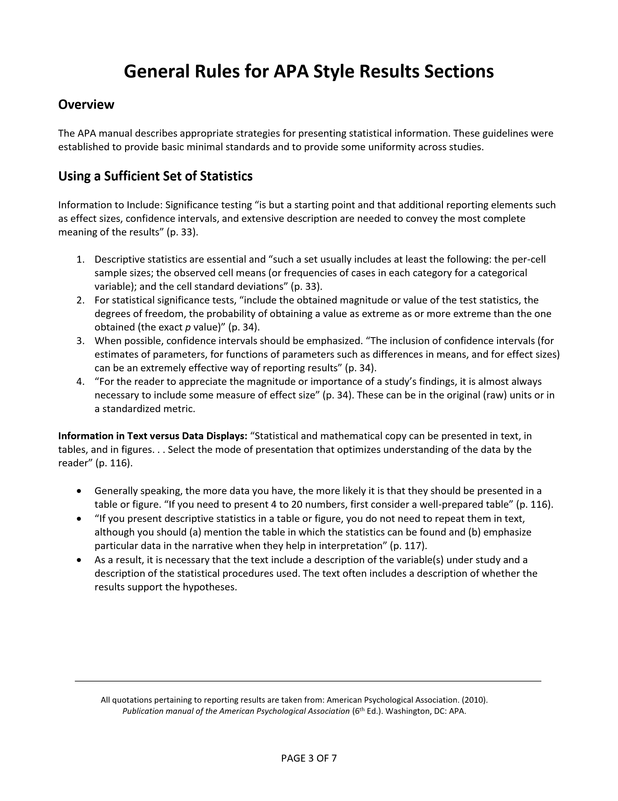
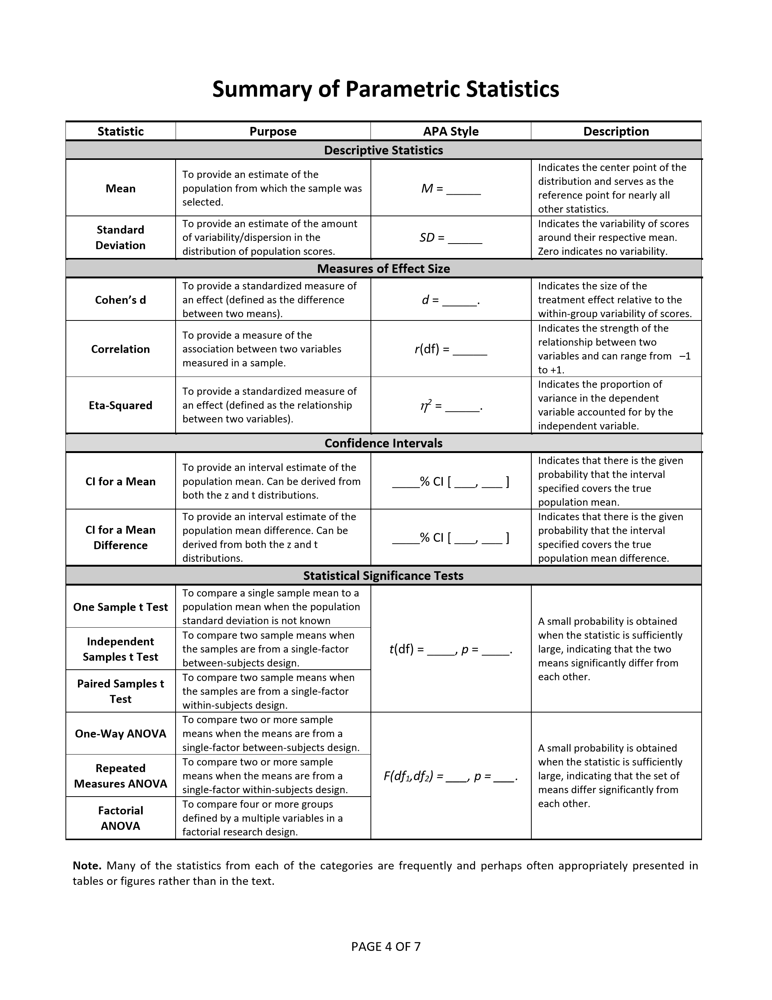
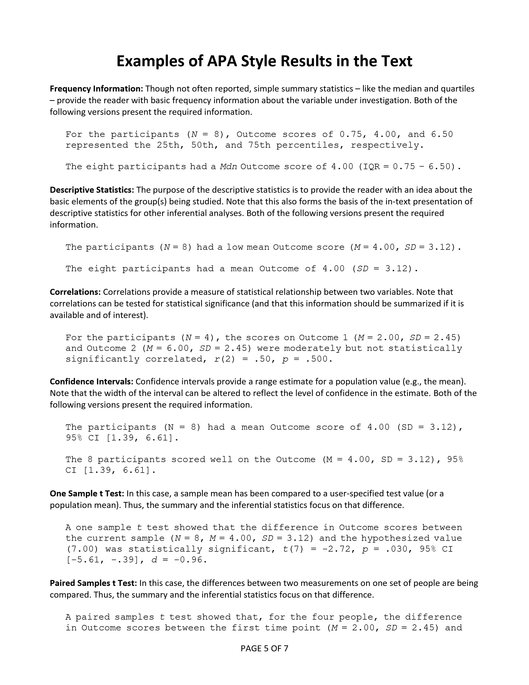
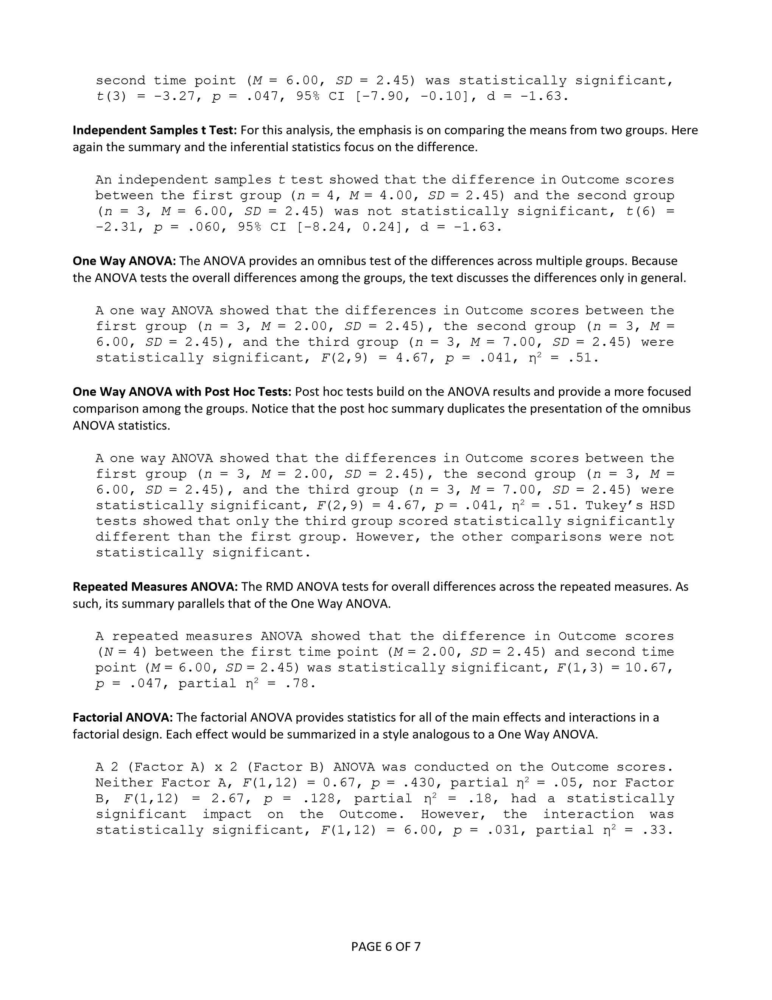
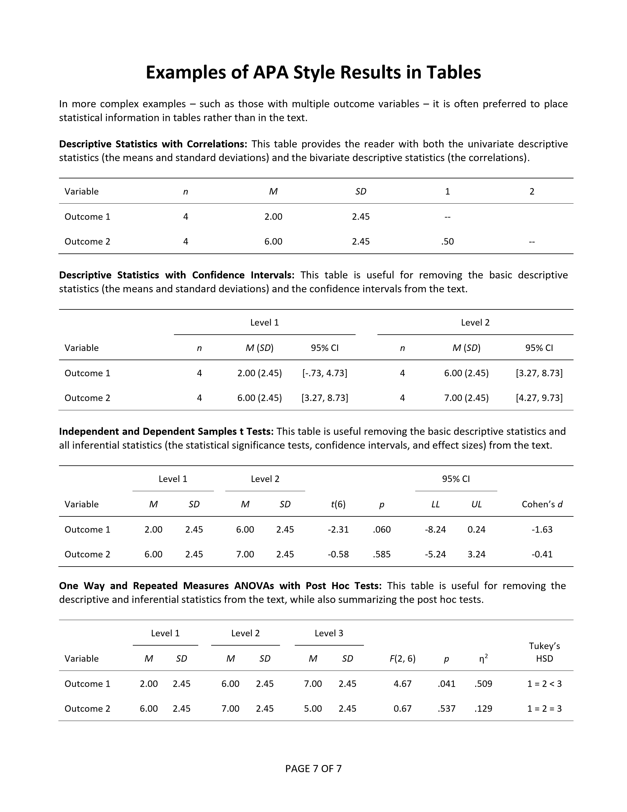

# Statistics for Social Science

### Statistical Methods: Reporting Statistics

---

**Abstract:** This chapter describes basic rules for presenting statistical results in APA style. All rules come from the newest APA style manual. Specific examples of mini Results summaries are provided, using the analyses elsewhere in this project. Sample data tables are provided for more complex examples.

> A proper HTML version is in development. For now, this chapter includes images based on the PDF version.

---

## Table of Contents for This Chapter

- [General Rules for APA Style Results Sections](#general-rules-for-apa-style-results-sections)
- [Summary of Parametric Statistics](#summary-of-parametric-statistics)
- [Examples of APA Style Results in the Text](#examples-of-apa-style-results-in-the-text)
- [Examples of APA Style Results in Tables](#examples-of-apa-style-results-in-tables)

---

## General Rules for APA Style Results Sections

<kbd></kbd>

## Summary of Parametric Statistics

<kbd></kbd>

## Examples of APA Style Results in the Text

<kbd></kbd>

<kbd></kbd>

## Examples of APA Style Results in Tables

<kbd></kbd>

