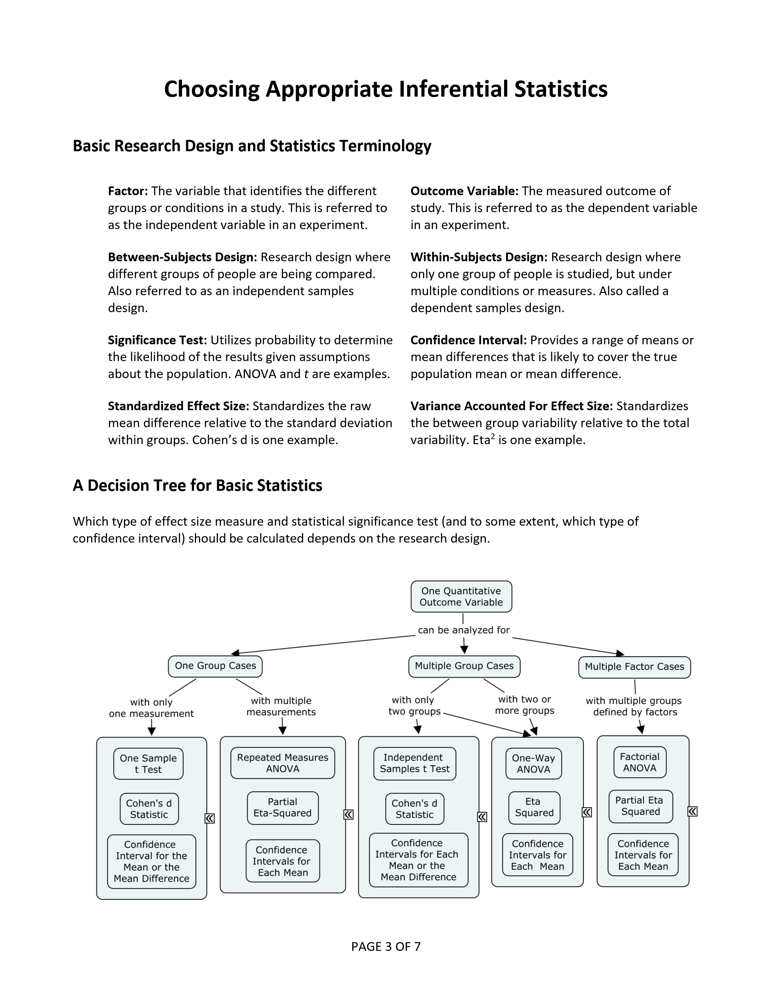
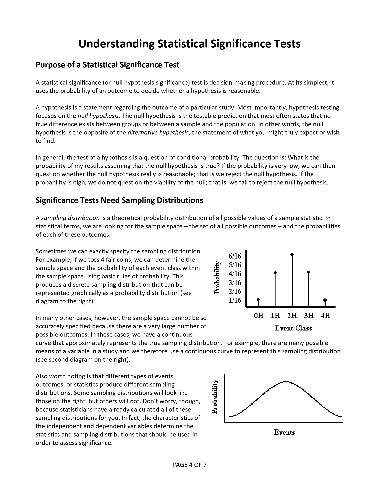
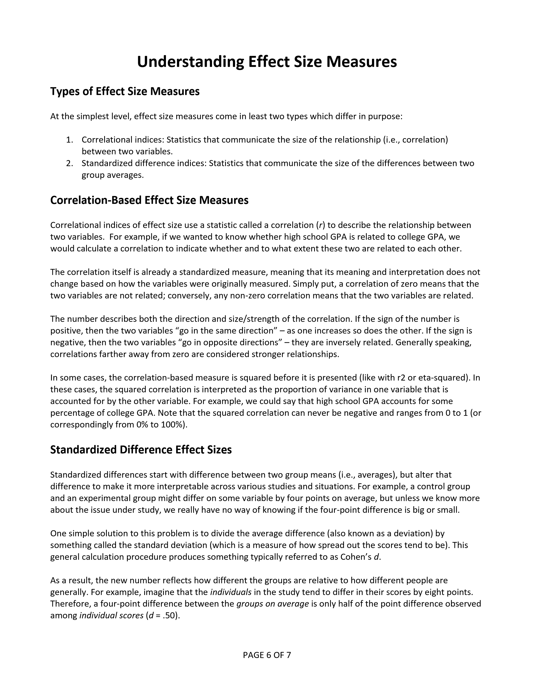
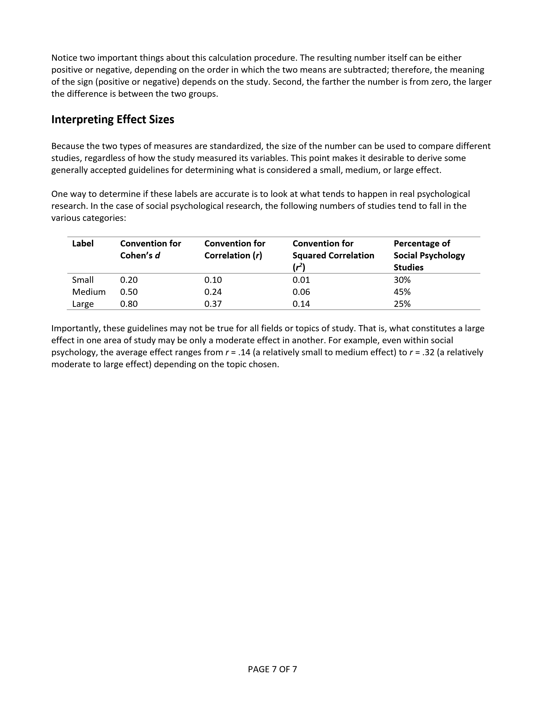

# Statistics for Social Science

### Statistical Methods: Statistical Analyses

---

**Abstract:** This section provides an overview of the basic types of statistical analyses. This starts with the basic terminology of statistics. It also includes a decision tree for highlighting the typical tests of statistical significance, confidence intervals, and effects sizes used for common univariate research designs.

> A proper HTML version is in development. For now, this chapter includes images based on the PDF version.

---

## Table of Contents for This Chapter

- [Choosing Appropriate Inferential Statistics](#choosing-appropriate-inferential-statistics)
- [Understanding Statistical Significance Tests](#understanding-statistical-significance-tests)
- [Understanding Effect Size Measures](#understanding-effect-size-measures)

---

## Choosing Appropriate Inferential Statistics

<kbd></kbd>

## Understanding Statistical Significance Tests

<kbd></kbd>

<kbd></kbd>

## Understanding Effect Size Measures

<kbd></kbd>

<kbd></kbd>
