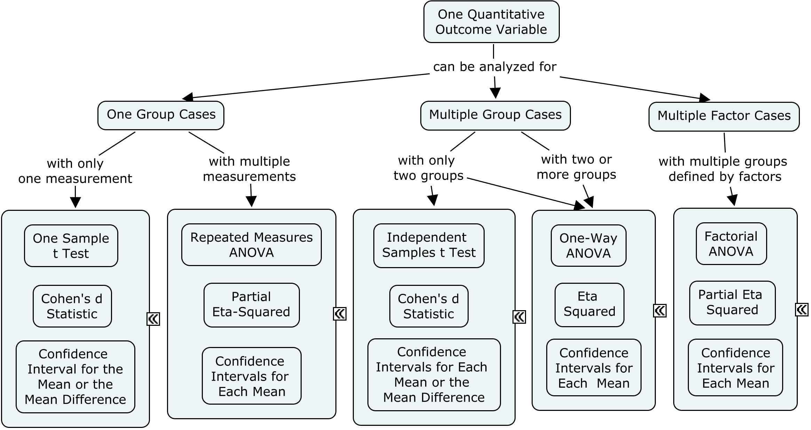
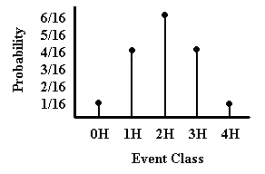
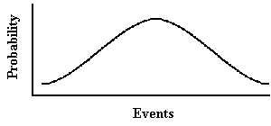

## Statistical Methods: Statistical Analyses

### Abstract

This chapter provides an overview of the basic types of statistical analyses. This starts with the basic terminology of statistics. It also includes a decision tree for highlighting the typical tests of statistical significance, confidence intervals, and effects sizes used for common univariate research designs.

### Table of Contents

- [Choosing Appropriate Inferential Statistics](#choosing-appropriate-inferential-statistics)
- [Understanding Statistical Significance Tests](#understanding-statistical-significance-tests)
- [Understanding Effect Size Measures](#understanding-effect-size-measures)

---

### Choosing Appropriate Inferential Statistics

#### Basic Research Design and Statistics Terminology

- Factor: The variable that identifies the different groups or conditions in a study. This is referred to as the independent variable in an experiment.
- Outcome Variable: The measured outcome of study. This is referred to as the dependent variable in an experiment. 
- Between-Subjects Design: Research design where different groups of people are being compared. Also referred to as an independent samples design.
- Within-Subjects Design: Research design where only one group of people is studied, but under multiple conditions or measures. Also called a dependent samples design.
- Significance Test: Utilizes probability to determine the likelihood of the results given assumptions about the population. ANOVA and *t* are examples.
- Confidence Interval: Provides a range of means or mean differences that is likely to cover the true population mean or mean difference. 
- Standardized Effect Size: Standardizes the raw mean difference relative to the standard deviation within groups. Cohen&#39;s *d* is one example.
- Variance Accounted For Effect Size: Standardizes the between group variability relative to the total variability. Eta2 is one example.

#### A Decision Tree for Basic Statistics

Which type of effect size measure and statistical significance test (and to some extent, which type of confidence interval) should be calculated depends on the research design.

<kbd></kbd>

---

### Understanding Statistical Significance Tests

#### Purpose of a Statistical Significance Test

A statistical significance (or null hypothesis significance) test is decision-making procedure. At its simplest, it uses the probability of an outcome to decide whether a hypothesis is reasonable.

A hypothesis is a statement regarding the outcome of a particular study. Most importantly, hypothesis testing focuses on the *null hypothesis*. The null hypothesis is the testable prediction that most often states that no true difference exists between groups or between a sample and the population. In other words, the null hypothesis is the opposite of the *alternative hypothesis*, the statement of what you might truly expect or wish to find.

In general, the test of a hypothesis is a question of conditional probability. The question is: What is the probability of my results assuming that the null hypothesis is true? If the probability is very low, we can then question whether the null hypothesis really is reasonable; that is we reject the null hypothesis. If the probability is high, we do not question the viability of the null; that is, we fail to reject the null hypothesis.

#### Significance Tests Need Sampling Distributions

A *sampling distribution* is a theoretical probability distribution of all possible values of a sample statistic. In statistical terms, we are looking for the sample space – the set of all possible outcomes – and the probabilities of each of these outcomes.

Sometimes we can exactly specify the sampling distribution. For example, if we toss 4 fair coins, we can determine the sample space and the probability of each event class within the sample space using basic rules of probability. This produces a discrete sampling distribution that can be represented graphically as a probability distribution (see diagram below).

<kbd></kbd>

In many other cases, however, the sample space cannot be so accurately specified because there are a very large number of possible outcomes. In these cases, we have a continuous curve that approximately represents the true sampling distribution. For example, there are many possible means of a variable in a study and we therefore use a continuous curve to represent this sampling distribution (see second diagram on the right).

Also worth noting is that different types of events, outcomes, or statistics produce different sampling distributions. Some sampling distributions will look like those on the right, but others will not. Don&#39;t worry, though, because statisticians have already calculated all of these sampling distributions for you. In fact, the characteristics of the independent and dependent variables determine the statistics and sampling distributions that should be used in order to assess significance.

<kbd></kbd>
 

The overarching important point is that because the sampling distribution represents the probabilities of all possible study outcomes, we can then use it to figure out where any one particular outcomes lies on it. Some outcomes will have higher probabilities (they are consistent with the null hypothesis) and other outcomes will have much lower probabilities (they are less consistent with the null hypothesis).

---

### Understanding Effect Size Measures

#### Types of Effect Size Measures

At the simplest level, effect size measures come in least two types which differ in purpose:

1. Correlational indices: Statistics that communicate the size of the relationship (i.e., correlation) between two variables.
2. Standardized difference indices: Statistics that communicate the size of the differences between two group averages.

#### Correlation-Based Effect Size Measures

Correlational indices of effect size use a statistic called a correlation (*r*) to describe the relationship between two variables. For example, if we wanted to know whether high school GPA is related to college GPA, we would calculate a correlation to indicate whether and to what extent these two are related to each other.

The correlation itself is already a standardized measure, meaning that its meaning and interpretation does not change based on how the variables were originally measured. Simply put, a correlation of zero means that the two variables are not related; conversely, any non-zero correlation means that the two variables are related.

The number describes both the direction and size/strength of the correlation. If the sign of the number is positive, then the two variables &quot;go in the same direction&quot; – as one increases so does the other. If the sign is negative, then the two variables &quot;go in opposite directions&quot; – they are inversely related. Generally speaking, correlations farther away from zero are considered stronger relationships.

In some cases, the correlation-based measure is squared before it is presented (like with r2 or eta-squared). In these cases, the squared correlation is interpreted as the proportion of variance in one variable that is accounted for by the other variable. For example, we could say that high school GPA accounts for some percentage of college GPA. Note that the squared correlation can never be negative and ranges from 0 to 1 (or correspondingly from 0% to 100%).

#### Standardized Difference Effect Sizes

Standardized differences start with difference between two group means (i.e., averages), but alter that difference to make it more interpretable across various studies and situations. For example, a control group and an experimental group might differ on some variable by four points on average, but unless we know more about the issue under study, we really have no way of knowing if the four-point difference is big or small.

One simple solution to this problem is to divide the average difference (also known as a deviation) by something called the standard deviation (which is a measure of how spread out the scores tend to be). This general calculation procedure produces something typically referred to as Cohen&#39;s *d*.

As a result, the new number reflects how different the groups are relative to how different people are generally. For example, imagine that the *individuals* in the study tend to differ in their scores by eight points. Therefore, a four-point difference between the *groups on average* is only half of the point difference observed among *individual scores* (*d* = .50).

Notice two important things about this calculation procedure. The resulting number itself can be either positive or negative, depending on the order in which the two means are subtracted; therefore, the meaning of the sign (positive or negative) depends on the study. Second, the farther the number is from zero, the larger the difference is between the two groups.

### Interpreting Effect Sizes

Because the two types of measures are standardized, the size of the number can be used to compare different studies, regardless of how the study measured its variables. This point makes it desirable to derive some generally accepted guidelines for determining what is considered a small, medium, or large effect.

One way to determine if these labels are accurate is to look at what tends to happen in real psychological research. In the case of social psychological research, the following numbers of studies tend to fall in the various categories:

| **Label** | **Convention for Cohen&#39;s *d*** | **Convention for Correlation (*r*)** | **Convention for  Squared Correlation (*r2*)** | **Percentage of Social Psychology Studies** |
| --- | --- | --- | --- | --- |
| Small | 0.20 | 0.10 | 0.01 | 30% |
| Medium | 0.50 | 0.24 | 0.06 | 45% |
| Large | 0.80 | 0.37 | 0.14 | 25% |

Importantly, these guidelines may not be true for all fields or topics of study. That is, what constitutes a large effect in one area of study may be only a moderate effect in another. For example, even within social psychology, the average effect ranges from *r* = .14 (a relatively small to medium effect) to *r* = .32 (a relatively moderate to large effect) depending on the topic chosen.