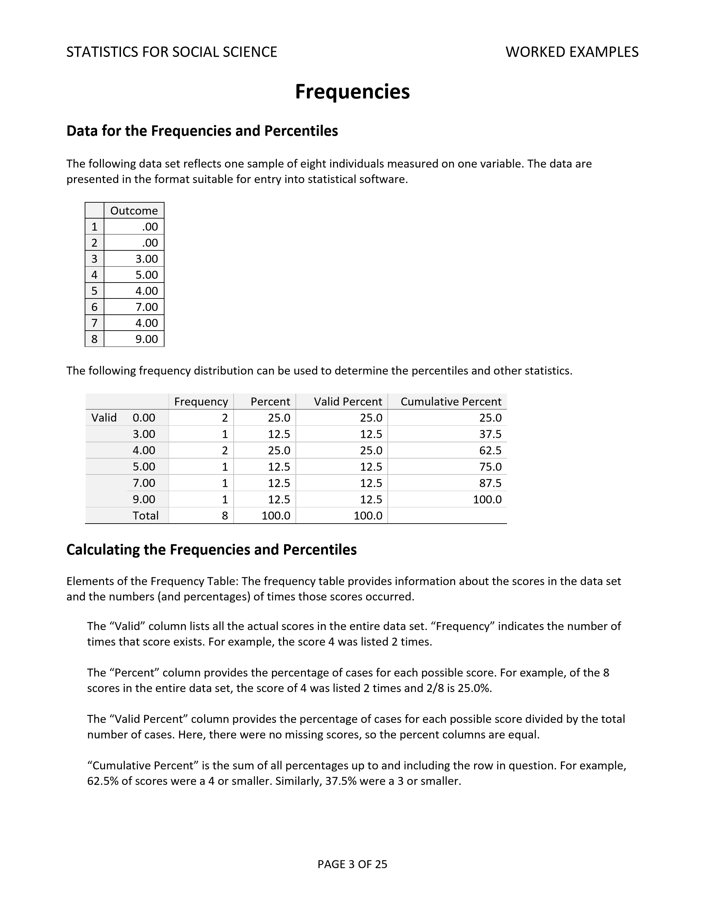

# Statistics for Social Science

### Statistical Methods: Worked Examples

---

**Abstract:** This chapter provides the complete set of worked examples for the sourcebook. All raw data, formulas, calculations, and summaries in APA style are provided for each type of research design.

---

## Table of Contents for This Chapter

- [Descriptives (Frequencies and Descriptives)](#descriptives-frequencies-and-descriptives)

---

## Descriptives

<kbd></kbd>

