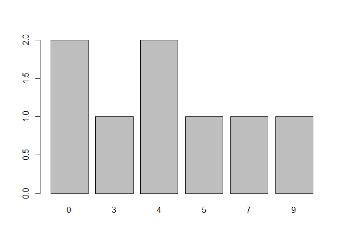

## Standardized Scores

### Enter Data


```r
Outcome <- c(0,0,3,5,4,7,4,9)
StandardizedData <- data.frame(Outcome)
StandardizedData
```

```
##   Outcome
## 1       0
## 2       0
## 3       3
## 4       5
## 5       4
## 6       7
## 7       4
## 8       9
```

### Calculate Frequencies


```r
FrequencyTable <- table(Outcome)
FrequencyTable
```

```
## Outcome
## 0 3 4 5 7 9 
## 2 1 2 1 1 1
```

```r
prop.table(FrequencyTable)
```

```
## Outcome
##     0     3     4     5     7     9 
## 0.250 0.125 0.250 0.125 0.125 0.125
```

```r
barplot(FrequencyTable)
```

<!-- -->

```r
mean(Outcome)
```

```
## [1] 4
```

```r
var(Outcome)
```

```
## [1] 9.714286
```

```r
sd(Outcome)
```

```
## [1] 3.116775
```

### Calculate Standardized Scores


```r
zScores <- scale(Outcome)
StandardizedData <- data.frame(Outcome,zScores)
StandardizedData
```

```
##   Outcome    zScores
## 1       0 -1.2833779
## 2       0 -1.2833779
## 3       3 -0.3208445
## 4       5  0.3208445
## 5       4  0.0000000
## 6       7  0.9625334
## 7       4  0.0000000
## 8       9  1.6042224
```

```r
zFrequencyTable <- table(Outcome)
zFrequencyTable
```

```
## Outcome
## 0 3 4 5 7 9 
## 2 1 2 1 1 1
```

```r
prop.table(zFrequencyTable)
```

```
## Outcome
##     0     3     4     5     7     9 
## 0.250 0.125 0.250 0.125 0.125 0.125
```

```r
barplot(zFrequencyTable)
```

<!-- -->

```r
mean(zScores)
```

```
## [1] -1.387779e-17
```

```r
var(zScores)
```

```
##      [,1]
## [1,]    1
```

```r
sd(zScores)
```

```
## [1] 1
```
