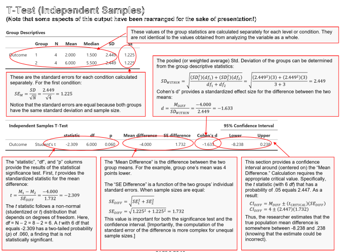

# Statistics for Social Science

## A Sourcebook of Basic Statistical Methods

### Overview

The materials in this online sourcebook are intended to facilitate the connection between standard introductory statistics concepts and their implementation in statistical software.

<kbd></kbd>

### Materials

The Sourcebook includes chapters on the following:

- [**Methods**](./Methods): Contains a statistics overview, statistical tables, and APA style for reporting
- [**SPSS**](./SPSS): Contains instructions, annotated output, and blank output for SPSS
- [**jamovi**](./jamovi): Contains instructions, annotated output, and blank output for jamovi
- [**JASP**](./JASP): Contains instructions, annotated output, and blank output for JASP
- [**Examples**](./Examples): Contains complete worked examples with data, calculations, and summaries

### Citation

Wendorf, C. A. (2019). _Statistics for social science: A sourcebook of basic statistical methods._ [https://cwendorf.github.io/Sourcebook/](https://cwendorf.github.io/Sourcebook/)
