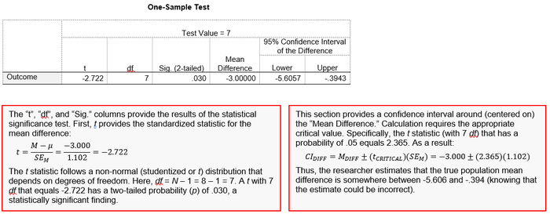

# `SOURCEBOOK` 

## Basic Statistical Methods for Social Science

### Purpose

This online [Sourcebook](https://cwendorf.github.io/Sourcebook/) is intended to facilitate the connection between standard introductory statistics concepts and their implementation in statistical software. With these materials, users should be able to:

- Choose and implement the appropriate analyses given the research design
- Demonstrate the connections between formulas, calculations, and computer output of analyses
- Summarize and interpret statistical analyses in correct APA style

### Scope

This Sourcebook contains a wide range of materials designed to assist with the use of statistical software such as IBM SPSS, jamovi, JASP, R (base functions), EASI (an R package), and CREATE (a collection of Excel spreadsheets). To that end, it contains:

- Instructions and screenshots that show how to enter data in the software packages
- Instructions and screenshots that show how to navigate and analyze the data in the software packages
- Annotations that show the link between simple formulas and the software packages' output

### Contact
 
- Author Email: [cwendorf@uwsp.edu](mailto:cwendorf@uwsp.edu)
- Author Homepage: [https://github.com/cwendorf](https://github.com/cwendorf)

### Citation

Wendorf, C. A. (2022). *Sourcebook: Basic statistical methods for social science.* [https://cwendorf.github.io/Sourcebook/](https://cwendorf.github.io/Sourcebook/)
