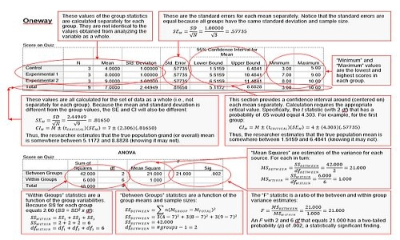

## Basic Statistical Methods for Social Science

### Overview

This online Sourcebook is intended to facilitate the connection between standard introductory statistics concepts and their implementation in statistical software. It uses written instructions, screenshots, and simple formulas to work through basic problems, demonstrate software, and summarize the analyses.

<kbd></kbd>

### Contents

The Sourcebook contains the following materials:

- [**Calculations**](./Calculations) - Contains statistical tables, formulas, and complete worked examples
- [**SPSS**](./SPSS) - Contains instructions, annotated output, and blank output for SPSS
- [**jamovi**](./jamovi) - Contains instructions, annotated output, and blank output for jamovi
- [**JASP**](./JASP) - Contains instructions, annotated output, and blank output for JASP
- [**EASI**](./EASI) - Contains instructions and annotated output for EASI (an R package)
- [**Summaries**](./Summaries) - Contains a statistics overview, an APA style guide, and APA summaries for the examples

Readers who use this Sourcebook to work sequentially through the topics of a typical undergraduate statistics course are encouraged to start in the special [**Topics**](./Topics) section.

### Citation

Wendorf, C. A. (2019). _Sourcebook: Basic statistical methods for social science._ [https://cwendorf.github.io/Sourcebook/](https://cwendorf.github.io/Sourcebook/)
