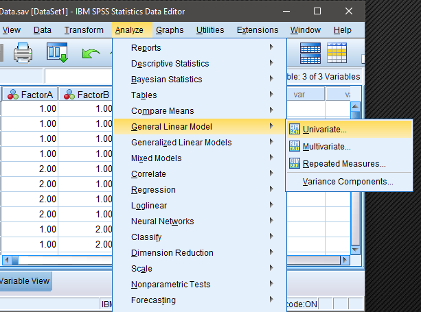
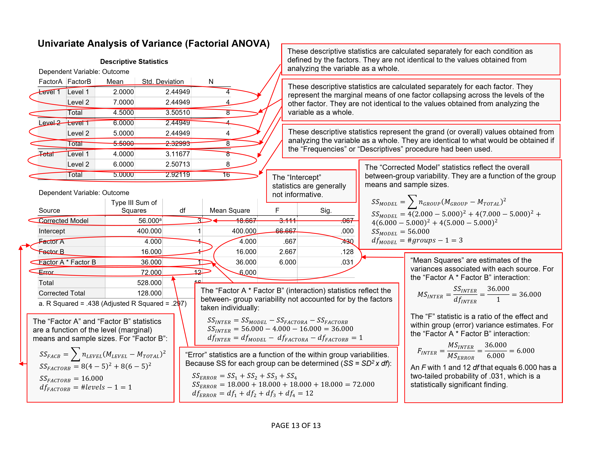
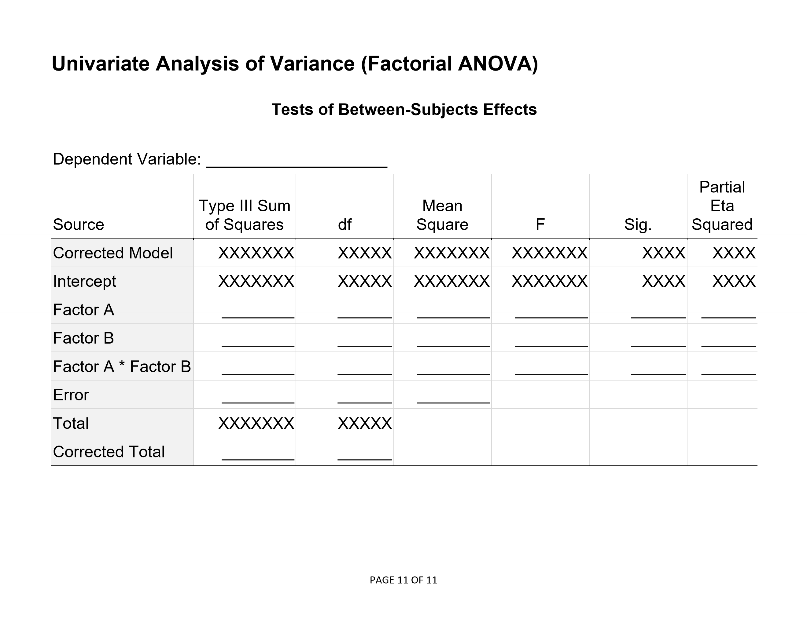

# Statistics for Social Science

## Using and Understanding SPSS

---

## Using the Software

[**Using the Software:**](./using-software/) This section provides step-by-step instructions on how to obtain basic statistical output using jamovi, both visually with screenshots and via written instructions. Simple examples for most undergraduate level between-subjects and within-subjects research designs are provided.

<kbd></kbd>

## Annotated Output

[**Annotated Output:**](./annotated-output/) This section provides stepbystep instructions on how to obtain basic statistical output using jamovi, both visually with screenshots and via written instructions. Simple examples for most undergraduatelevel betweensubjects and withinsubjects research designs are provided.

<kbd></kbd>

## Blank Output

[**Blank Output:**](./blank-output/) This section provides stepbystep instructions on how to obtain basic statistical output using jamovi, both visually with screenshots and via written instructions. Simple examples for most undergraduatelevel betweensubjects and withinsubjects research designs are provided.

<kbd></kbd>

