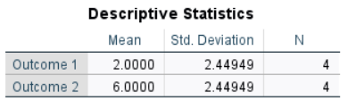

## SPSS: Annotated Output

This chapter is intended to facilitate the connection between standard introductory statistics concepts and their implementation in SPSS. It shows the output from various types of analyses, describes how to interpret the output, and shows the link between hand calculation formulas and SPSS output.

- [Frequencies (Frequencies and Descriptives)](#frequencies-frequencies-and-descriptives)
- [Correlations (Bivariate)](#correlations-bivariate)
- [Explore (Descriptives and Confidence Intervals)](#explore-descriptives-and-confidence-intervals)
- [T Test (One Sample)](#t-test-one-sample)
- [T Test (Paired Samples)](#t-test-paired-samples)
- [T Test (Independent Samples)](#t-test-independent-samples)
- [OneWay (OneWay ANOVA)](#oneway-oneway-anova)
- [Post Hoc Tests (OneWay ANOVA)](#post-hoc-tests-oneway-anova)
- [General Linear Model (Repeated Measures ANOVA)](#general-linear-model-repeated-measures-anova)
- [ANOVA (Factorial ANOVA)](#anova-factorial-anova)

---

### Frequencies (Frequencies and Descriptives)

<kbd></kbd>

---

### Correlations (Bivariate)

<kbd></kbd>

---

### Explore (Descriptives and Confidence Intervals)

<kbd></kbd>

---

### T Test (One Sample)

<kbd></kbd>

---

### T Test (Paired Samples)

<kbd></kbd>

---

### T Test (Independent Samples)

<kbd></kbd>

---

### OneWay (OneWay ANOVA)

<kbd></kbd>

---

### Post Hoc Tests (OneWay ANOVA)

<kbd></kbd>

---

### General Linear Model (Repeated Measures ANOVA)

<kbd></kbd>

<kbd></kbd>

---

### ANOVA (Factorial ANOVA)

<kbd></kbd>

