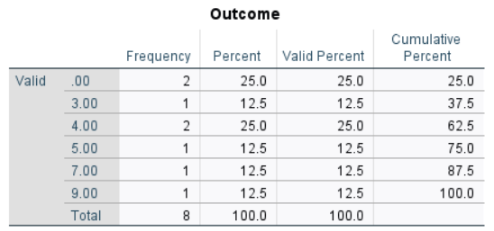
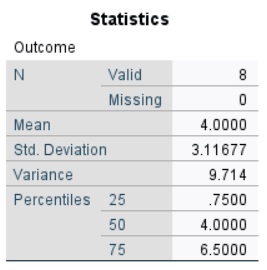

# [SPSS Articles](../index.md)

## Annotated Output | Descriptives

### Computer Output

The frequency distribution can be used to determine the descriptive statistics.

{. table}

The table of descriptive statistics shows the key elements to be calculated.

{. table}

### Calculations

Mean: The mean ("M") is calculated as an unbiased estimate of the population mean. Here, the mean is determined as the average of the scores weighted by their frequencies:

> $$ M = \frac{\sum(fY)}{N} = \frac{(2 \times 0) + (1 \times 3) + (2 \times 4) + (1 \times 5) + (1 \times 7) + (1 \times 8)}{8} = 4.000 $$

Sum of Squares: The Sum of Squares (not shown in the output) is the basic measure of the variability of the scores. Formally, it is the sum of the weighted deviations of the scores about the mean.

> $$ SS = \sum f (Y - M) = 2 (0 - 4)^2 + 1(3 - 4)^2 + 2(4 - 4)^2 + 1(5 - 4)^2 + 1(7 - 4)^2 + 1(8 - 4)^2 = 68.000 $$

Mean Squares: Mean Squares (also known as "Variance") is a function of the Sum of Squares. It is calculated as an unbiased estimate of the population variance.

> $$ MS = \frac{SS}{(N - 1)} = \frac{68.000}{7} = 9.714 $$

Standard Deviation: Standard Deviation ("SD") is a function of Mean Squares. It is also calculated as an unbiased estimate of the population standard deviation.

> $$ SD = \sqrt{MS} = \sqrt{9.714} = 3.117 $$

### APA Style

The purpose of descriptive statistics is to provide the reader with an idea about the basic elements of the group(s) being studied. Note that this also forms the basis of the in-text presentation of descriptive statistics for other inferential analyses. Both of the following versions present the required information, though the second focuses more on the interpretation of the statistic.

> The eight participants had a mean Outcome of 4.00 (*SD* = 3.12).

> The participants (*N* = 8) had a low mean Outcome score (*M* = 4.00, *SD* = 3.12).
