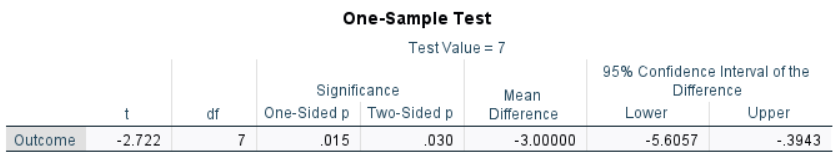

# [SPSS Articles](../index.md)

## Annotated Output | One Sample t Test

### Computer Output

The table of descriptive statistics can be used to determine the inferential statistics.

The table of inferential statistics shows the key elements to be calculated.

### Calculations

Descriptive Statistics: The values of the one-sample statistics are identical to the values that would be provided by the “Descriptives” procedure.

Standard Error of the Mean: The standard error of the mean provides an estimate of how spread out the distribution of all possible random sample means would be.

> $$ SE_M = \frac{SD}{\sqrt{N}} = \frac{3.117}{\sqrt{8}} = 1.102 $$

Mean Difference (Raw Effect): The Mean Difference is the difference between the sample mean and a user-specified test value or population mean.

> $$ M_{DIFF} = M - \mu = 4.000 − 7.000 = −3.000 $$

Statistical Significance: The *t* statistic is the ratio of the mean difference (raw effect) to the standard error of the mean.

> $$ t = \frac{M_{DIFF}}{SE_M} = \frac{-3.000}{1.102} = -2.722 $$
>
> With *df* = 7, *tCRITICAL* = 2.365  
> Because *t* > *tCRITICAL*, *p* < .05  
> This would be considered a statistically significant finding.

Confidence Interval: For this design, the appropriate confidence interval is around (centered on) the mean difference (raw effect).

> $$ CI_{DIFF} = M_{DIFF} \pm (t_{CRITICAL} ) (SE_M) = -3.000 \pm (2.365) (1.102) = [ -5.606, -0.394 ] $$
>
> Thus, the researcher concludes that the true population mean difference is somewhere between -5.606 and -0.394 (knowing that the estimate could be wrong).

Effect Size: Cohen’s *d* Statistic provides a standardized effect size for the mean difference (raw effect).

> $$ d = \frac{M_{DIFF}}{SD} = \frac{-3.000}{3.117} = 0.963 $$
>
> Given Cohen's heuristics for interpreting effect sizes, this would be considered a large effect.

### APA Style

For this analysis, a sample mean has been compared to a user-specified test value (or a population mean). Thus, the summary and the inferential statistics focus on that difference. The first example focuses on statistical significance testing, whereas the second version includes and emphasizes interpretation of the confidence interval and effect size.

> A one sample *t* test showed that the difference in Outcome scores between the current sample (*N* = 8, *M* = 4.00, *SD* = 3.12) and the hypothesized value (7.00) was statistically significant, *t*(7) = -2.72, *p* = .030.

> Analyses revealed that the current sample (*N* = 8, *M* = 4.00, *SD* = 3.12) had dramatically higher Outcome scores than the hypothesized value (7.00), 95% CI [-5.61, -.39], *d* = -0.96, *t*(7) = -2.72, *p* = .030.
