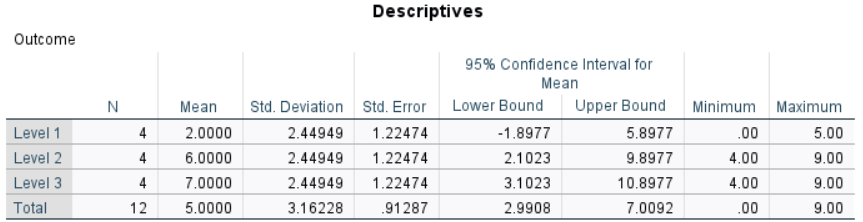
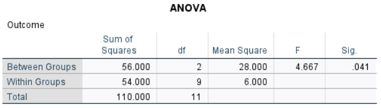

# [SPSS Articles](../index.md)

## Annotated Output | One-Way ANOVA

### Computer Output

The table of descriptive statistics can be used to determine the inferential statistics.

{: .output}

The table of inferential statistics shows the key elements to be calculated.

{: .output}

### Calculations

Descriptive Statistics: The values of the group statistics are calculated separately for each group. They are not identical to the values obtained from analyzing the variable as a whole.

Within Groups Statistics: Within-groups error statistics are a function of the within group variabilities.

> $$ SS_1 = ( SD_1^2 ) ( df_1 ) = ( 2.44949^2 ) ( 3 ) = 18.000 $$
>
> $$ SS_2 = ( SD_2^2 ) ( df_2 ) = ( 2.44949^2 ) ( 3 ) = 18.000 $$
>
> $$ SS_3 = ( SD_3^2 ) ( df_3) = ( 2.44949^2 ) ( 3 ) = 18.000 $$
>
> $$ SS_{WITHIN} = SS_1 + SS_2 + SS_3 = 18.000 + 18.000 + 18.000 = 54.000 $$
>
> $$ df_{WITHIN} = df_1 + df_2 + df_3 = 3 + 3 + 3 = 9 $$
>
> $$ MS_{WITHIN} = \frac{SS_{WITHIN}}{df_{WITHIN}} = \frac{54.000}{9} = 6.000 $$

Grand (or Total) Mean: A grand mean can be determined by taking the weighted average of all of the group means.

> $$ M_{TOTAL} = \frac{\sum n_{GROUP} (M_{GROUP})}{N} = \frac{ 4 (2.000) + 4 (6.000) + 4 (7.000) }{( 4 + 4 + 4 )} = 5.000 $$

Between Groups Statistics: The between-groups effect statistics are a function of the group (level) means and sample sizes.

> $$ SS_{BETWEEN} = \sum n_{GROUP} (M_{GROUP} - M_{TOTAL})^2 = 4 ( 2.000 - 5.000 )^2 + 4 ( 6.000 - 5.000 )^2 + 4 ( 7.000 - 5.000 )^2 = 56.000  $$
>
> $$ df_{BETWEEN} = \text{# groups} − 1 = 3 − 1 = 2 $$
>
> $$ MS_{BETWEEN} = \frac{SS_{BETWEEN}}{df_{BETWEEN}} = \frac{56.000}{2} = 28.000 $$

Statistical Significance: The *F* statistic is the ratio of the between- and within-group variance estimates. 

> $$ F = \frac{MS_{BETWEEN}}{MS_{WITHIN}} = \frac{28.000}{6.000} = 4.667 $$
>
> With *dfBETWEEN* = 2 and *dfWITHIN* = 9, *FCRITICAL* = 4.256  
> Because *F* > *FCRITICAL*, *p* < .05  
> This would be considered a statistically significant finding.

Confidence Intervals: For ANOVA, calculate the confidence intervals around (centered on) each mean separately.

> Because each group has 3 *df*, *tCRITICAL* = ±3.182 
> 
> $$ CI_{M_1} = M_1 \pm (t_{CRITICAL}) (SE_{M_1}) = 2.000 \pm (3.182) (1.225) = [ −1.898, 5.898 ] $$
>
> $$ CI_{M_2} = M_2 \pm (t_{CRITICAL}) (SE_{M_2}) = 6.000 \pm (3.182) (1.225) = [ 2.102, 9.898 ] $$
>
> $$ CI_{M_3} = M_3 \pm (t_{CRITICAL}) (SE_{M_3}) = 7.000 \pm (3.182) (1.225) = [ 3.102, 10.898 ] $$
>
> For each group, the researcher estimates the true population mean (knowing that the estimates could be incorrect).

Effect Size: The Eta-Squared statistic is a ratio of the between group and the total group variability (Sum of Squares) estimates.

> $$ \eta^2 = \frac{SS_{BETWEEN}}{( SS_{BETWEEN} + SS_{WITHIN} )} = \frac{56.000}{( 56.000 + 54.000 )} = .509 $$
>
> Thus, 50.9% of the variability among all of the scores in the study is accounted for by group membership.

### APA Style

The ANOVA provides an omnibus test of the differences across multiple groups. Because the ANOVA tests the overall differences among the groups, the text discusses the differences in general. The first example focuses on statistical significance testing, whereas the second version includes and emphasizes interpretation of the effect size. 

> A one way ANOVA showed that the differences in Outcome scores between the first group (*n* = 3, *M* = 2.00, *SD* = 2.45), the second group (*n* = 3, *M* = 6.00, *SD* = 2.45), and the third group (*n* = 3, *M* = 7.00, *SD* = 2.45) were statistically significant, *F*(2,9) = 4.67, *p* = .041.

> Analyses revealed large overall differences in Outcome scores between the first group (*n* = 3, *M* = 2.00, *SD* = 2.45), the second group (*n* = 3, *M* = 6.00, *SD* = 2.45), and the third group (*n* = 3, *M* = 7.00, *SD* = 2.45), *η2* = .51, *F*(2,9) = 4.67, *p* = .041.

Alternatively, the means, standard deviations, and confidence intervals could be presented in a table or figure associated with this text.
