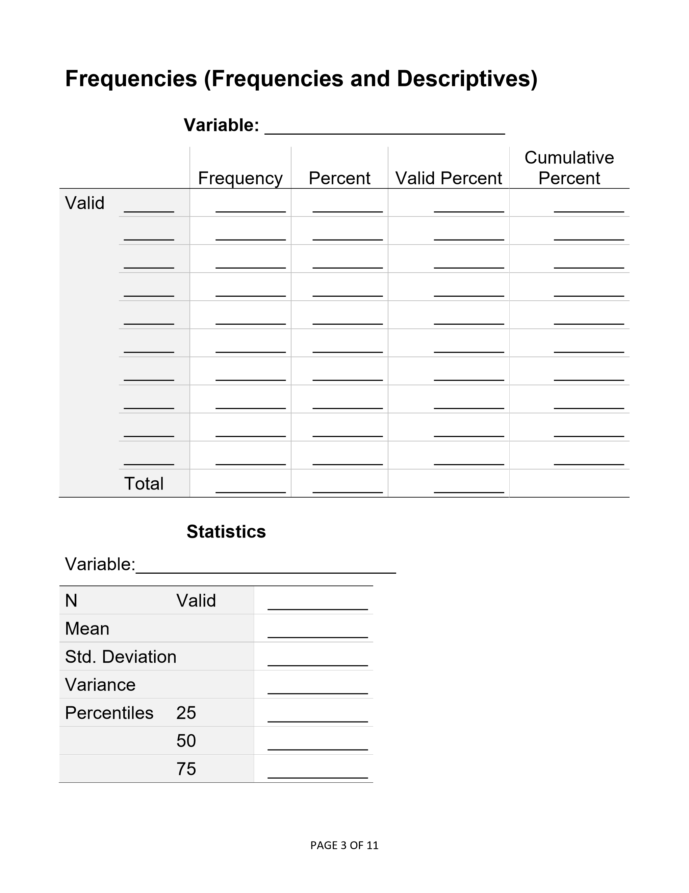
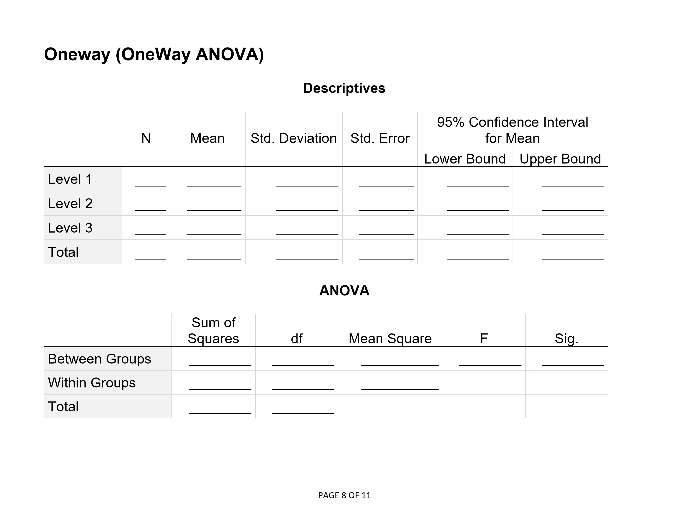

# Statistics for Social Science

### SPSS: Blank Output

---

**Abstract:** This chapter is used as a set of worksheets for class problems. Students fill in their answers on these sheets, thus making clear the links between non-computer (“hand”) calculations and the SPSS output.

---

## Table of Contents for This Chapter

- [Frequencies (Frequencies and Descriptives)](#frequencies-frequencies-and-descriptives)
- [Correlations (Bivariate)](#correlations-bivariate)
- [T Test (One Sample)](#t-test-one-sample)
- [T Test (Paired Samples)](#t-test-paired-samples)
- [T Test (Independent Samples)](#t-test-independent-samples)
- [OneWay (OneWay ANOVA)](#oneway-oneway-anova)
- [Post Hoc Tests (OneWay ANOVA)](#post-hoc-tests-oneway-anova)
- [General Linear Model (Repeated Measures ANOVA)](#general-linear-model-repeated-measures-anova)
- [ANOVA (Factorial ANOVA)](#anova-factorial-anova)

---

## Frequencies (Frequencies and Descriptives)

<kbd></kbd>

## Correlations (Bivariate)

<kbd></kbd>

## T Test (One Sample)

<kbd></kbd>

## T Test (Paired Samples)

<kbd></kbd>

## T Test (Independent Samples)

<kbd></kbd>

## OneWay (OneWay ANOVA)

<kbd></kbd>

## Post Hoc Tests (OneWay ANOVA)

<kbd></kbd>

## General Linear Model (Repeated Measures ANOVA)

<kbd></kbd>

## ANOVA (Factorial ANOVA)

<kbd></kbd>

